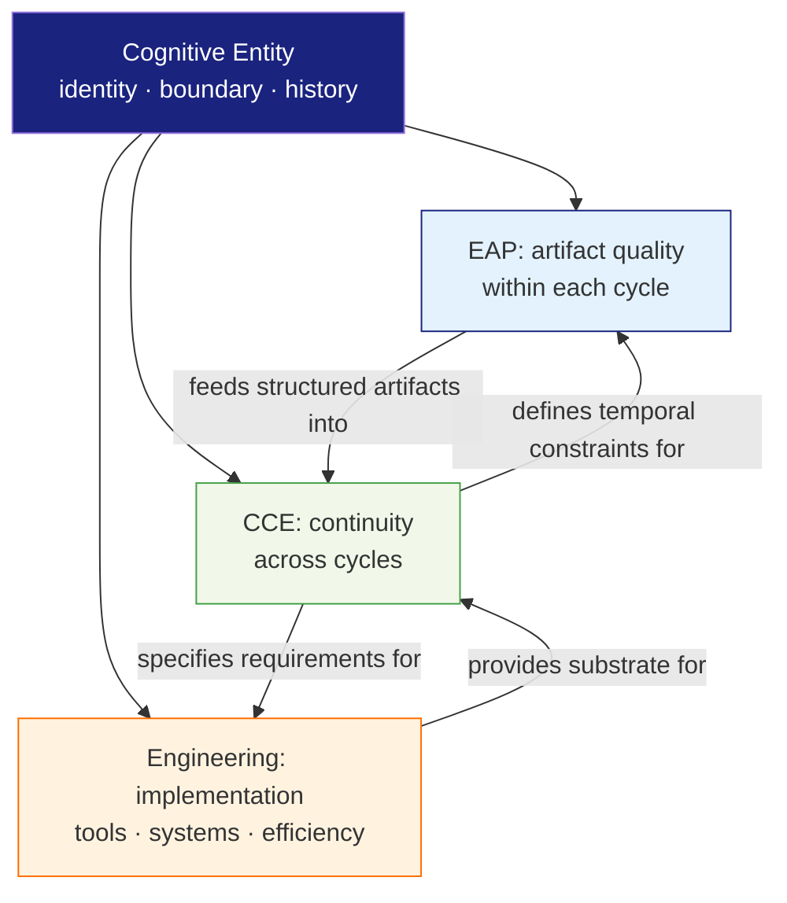
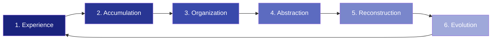
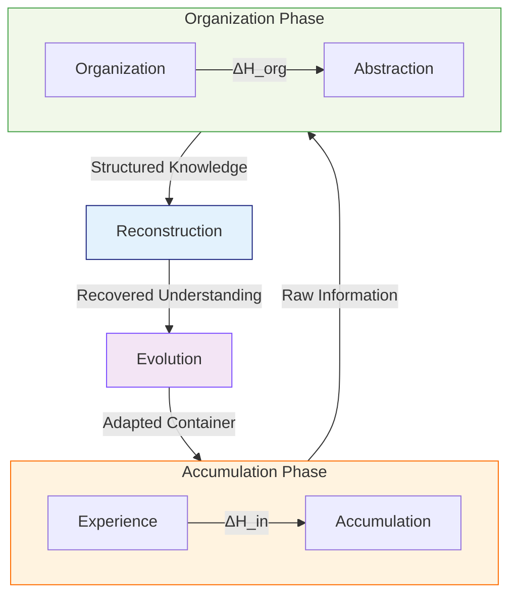
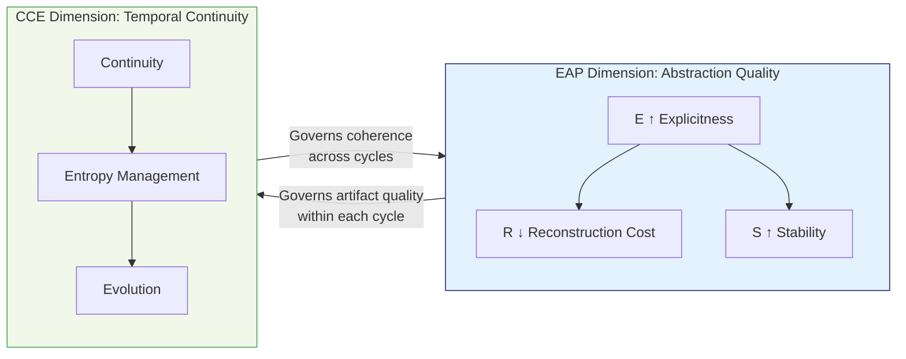
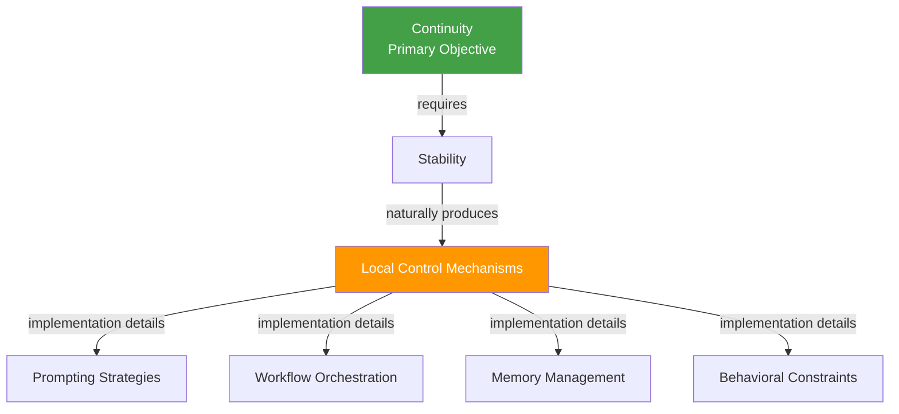

# Cognitive Continuity Engineering (CCE)

> **Cognitive Continuity Engineering is the engineering discipline of maintaining the identity, accessibility, and evolution of a cognitive entity through time under bounded resources and irreversible uncertainty.**

---

## 1. Introduction

### 1.1 Why a New Discipline?

Humanity is entering an era where cognition is no longer an exclusively biological process. Language models, software agents, and knowledge repositories now participate in cognitive work at scale — but our engineering frameworks still treat cognition as a sequence of discrete events rather than a continuous process.

Existing fields do not address this gap. **[Cognitive Engineering](https://doi.org/10.1002%2F0471028959.sof045)**, as traditionally defined, studies how to design systems that support human cognitive performance during individual tasks — optimizing interfaces, reducing error rates, and improving decision speed. It treats cognition as a **task-level phenomenon**: each interaction is an isolated unit to be optimized.

**Cognitive Continuity Engineering (CCE)** studies a fundamentally different object: cognition as a **continuous dynamic process** whose current state depends upon its entire historical trajectory. Its primary concern is not the optimization of single interactions, but the engineering of systems capable of sustaining coherent cognitive evolution across extended temporal horizons.

This distinction is not academic. Consider:

- A team of developers works with an LLM-powered coding assistant over six months. After the third month, the assistant's context has become so fragmented that it suggests architectures contradicting decisions made in month one. The assistant has no mechanism for **continuity** — it only has mechanisms for individual sessions.
- A research group maintains a shared knowledge base. Over time, entries become duplicated, assumptions become obsolete, and abstractions drift apart without anyone noticing. The knowledge base accumulates **entropy** — not because it was poorly designed for any single task, but because no engineering discipline governs what happens to cognition across time.

These failures are not failures of traditional cognitive engineering. They are failures of **continuity engineering** — a category of problem that no existing discipline systematically addresses.

### 1.2 Why "Continuity" and Not "Memory"?

A design choice worth making explicit: this discipline is called **Cognitive Continuity Engineering**, not Cognitive Memory Engineering.

The distinction is fundamental:

| | Memory (mechanism) | Continuity (property) |
|---|---|---|
| **What it is** | A concrete mechanism for storing and retrieving information | An emergent property of the cognitive system as a whole |
| **Engineering analogy** | Cache in networking — a specific implementation technique | **Connectivity** in networking — the property the entire system is engineered to maintain |
| **Failure mode** | Forgetting specific facts | Losing the ability to reconstruct coherent cognitive state |

In networking, the objective is not to optimize caching — it is to maintain **connectivity**. In control engineering, the objective is not to perfect feedback loops — it is to maintain **stability**. Similarly, CCE's objective is not to maximize memory fidelity — it is to maintain **cognitive continuity**: the property that a cognitive system can persist, evolve, and remain reconstructable over time.

This framing has a crucial consequence: CCE studies **continuity as an engineerable property of cognitive systems** — not Session, Memory, Skill, or Agent as specific mechanisms. Those mechanisms are implementation details of continuity, not the object of study itself.

### 1.3 Theoretical Domain Boundaries

CCE does not claim to answer every question about cognition. An essential theoretical move is drawing clear boundaries between domains:

| Question | Domain |
|----------|--------|
| How should thought be expressed? | **EAP** (Explicit Abstraction Principle) |
| How should knowledge be organized? | **EAP** |
| How should cognition persist across time? | **CCE** |
| How should tools and systems be implemented? | **Serenity** (or any concrete engineering platform) |
| How should local task efficiency be improved? | **Engineering** (traditional domain-specific optimization) |
| Does consciousness exist? Is an AI alive? | **Philosophy / Science** — explicitly outside CCE's scope |

This domain cutting is not merely taxonomic — it is **theoretical hygiene**. By declaring what CCE does *not* study, the theory avoids:

- **Scope creep**: CCE does not need to solve consciousness to be valid
- **Vagueness by inclusion**: CCE is not a "theory of everything cognitive"
- **Premature integration**: CCE and EAP are complementary neighbors, not hierarchical layers — each has its own object of study

The relationship between these domains can be visualized as adjacent governing concerns over a shared cognitive entity:

The key insight: **CCE studies the continuity of a cognitive entity — not the quality of its individual artifacts (EAP's domain), not the implementation of its tools (Engineering's domain), and certainly not the nature of its consciousness (Philosophy's domain).**

---

## 2. Core Concepts

### 2.1 Cognitive Container

> **Cognitive Container**
> *A bounded cognitive space within which cognition may accumulate, reorganize, and evolve. The container provides identity, boundaries, persistent memory, operational constraints, and evolutionary history.*

Continuous cognition requires a persistent environment. Without a container — without boundaries that define what belongs and what does not — there is no substrate on which continuity can be maintained.

A Cognitive Container provides five defining properties:

| Property | Function |
|----------|----------|
| **Identity** | Distinguishes this cognitive system from others; provides a stable referent for continuity |
| **Boundaries** | Defines what is inside vs. outside the cognitive space; constrains scope |
| **Persistent Memory** | Retains accumulated cognition across time; the substrate for evolution |
| **Operational Constraints** | Defines what operations are permissible within the container (tools, access, rules) |
| **Evolutionary History** | Records the trajectory of cognitive change; enables reconstruction |

**Example.** A Concrete Cognitive Container (CCC) — the runtime instance of an Abstract Cognitive Container (ACC) — exemplifies this concept. The CCC has a root directory (identity), file-system boundaries (boundaries), persistent session records (persistent memory), a defined set of tools and MSMs (operational constraints), and a git history tracking all changes (evolutionary history). When an agent enters the CCC, it inherits this bounded context; when it leaves, the context persists. Continuity belongs to the container, not to any individual agent.

### 2.2 Cognitive Trajectory

> **Cognitive Trajectory**
> *The temporal sequence of cognitive states within a container, where each state is a function of all prior states. The fundamental unit of analysis in CCE — replacing the discrete "interaction" as the primary object of study.*

Traditional cognitive engineering models cognition as a sequence of independent events — tasks, sessions, conversations. CCE replaces this with the concept of a **trajectory**: a continuous path through cognitive state-space where each state is causally dependent on the preceding states.

Formally, for a cognitive container C over time t₀, t₁, ..., tₙ:

> **C(tₙ) = f(C(tₙ₋₁), Δₙ)**
>
> Where Δₙ is the cognitive delta introduced at time tₙ — new information, decisions, abstractions, or reorganizations.

This means: the current state of the container is not determined by the most recent interaction alone. It is determined by the **entire history** of cognitive deltas applied to the container since its inception. Every interaction modifies the future state of the system — whether intended or not.

**Example.** When an agent makes a design decision within a CCC and records it in a session document, that decision becomes part of C(t). All future agents interacting with the container encounter this decision as part of the container's state. If the decision was poorly documented (low explicitness), future agents will either misinterpret it (divergent trajectory) or spend additional cognitive resources reconstructing the original reasoning (increased reconstruction cost). The trajectory is shaped by every decision, good or bad, explicit or implicit.

### 2.3 Cognitive Identity Boundary

> **Cognitive Identity Boundary**
> *The boundary that defines "which continuous entity is evolving." CCE's subject is not a biological agent — it is any cognitive entity with a persistent identity boundary across time.*

CCE does not need to answer the philosophical question "who is thinking?" That belongs to the philosophy of mind. What CCE needs to answer is a narrower, engineering question: **"which continuous entity is evolving?"**

A Cognitive Identity Boundary is what makes something count as *one thing* over time:

| Entity | Identity Boundary | CCE Object |
|--------|-------------------|------------|
| **Human** | Biological continuity + autobiographical memory | A life trajectory |
| **Project** | Shared goals, artifacts, and institutional memory | A project trajectory |
| **Nation** | Legal continuity, cultural memory, historical narrative | A civilizational trajectory |
| **Narrative** | Internal coherence of story elements across tellings | A narrative trajectory |
| **CCC** | Root directory, tool set, session history | A container trajectory |

The abstraction is elegant in its generality: **CCE's "subject" is not a living subject — it is a cognitive entity with a continuous boundary.** The word "a" — *a* company, *a* civilization, *a* story — is doing critical work. Language does not merely *describe* boundaries; language *participates in creating* them. When we say "a project," we are not just labeling a pre-existing category — we are constituting the boundary that makes continuity engineering possible.

This connects directly to EAP's analysis of language as interface (§3 of the EAP theory). Language constructs the cognitive boundaries that CCE then engineers for continuity. The two theories share a common foundation in recognizing that linguistic structures are not passive descriptions but active boundary-forming operations.

**Engineering consequence.** A Cognitive Identity Boundary must be:

1. **Stable enough** to serve as a persistent referent — if the boundary shifts unpredictably, continuity is undermined at the substrate level
2. **Permeable enough** to admit new information, agents, and reorganization — an impermeable boundary prevents evolution
3. **Explicitly encoded** — an implicit boundary (e.g., "we all just know what this project is") cannot be engineered; it must be externalized as a defined structure

---

## 3. Five Fundamental Assumptions

CCE is founded on five assumptions. Each is stated, exemplified, and — where applicable — given a formal expression.

### 3.1 Assumption 1: Cognition is Continuous

> A cognitive system should not be modeled as independent conversations or independent tasks. Cognition is a continuous process whose current state depends upon its historical trajectory.

Every interaction modifies the future state of the system. The fundamental unit of analysis is not an interaction — it is a **cognitive trajectory**.

**Example.** A developer asks an AI assistant "refactor this function." If each request is treated as independent, the assistant may produce a refactoring that conflicts with architectural decisions made in prior sessions. In a CCE framework, the assistant's response is conditioned on the full trajectory — prior design decisions, coding conventions established over time, known constraints — not just the current prompt.

**Formal expression:**

> **C(tₙ) ≠ C(t₀) + ΣΔᵢ** (non-additive)
>
> The container at time tₙ is not the sum of independent deltas. The order, context, and interrelationship of deltas matters.

---

### 3.2 Assumption 2: Cognition Exists Within Bounded Spaces

> Continuous cognition requires a persistent environment. Without bounded spaces — without identity, boundaries, and memory — continuity cannot be maintained.

A Cognitive Container is the necessary substrate. Unbounded cognition disperses; only within defined boundaries can it accumulate and evolve.

**Example.** A Slack channel accumulates messages, but it is not a Cognitive Container. It has no persistent memory structure beyond chronological threads, no mechanism for organizing abstractions, no evolutionary history that can be queried. Knowledge in a Slack channel decays — not because people forget, but because the space itself provides no continuity substrate. Compare this to a well-maintained git repository with structured commit messages, design documents, and an architecture decision record: the latter is a Cognitive Container; the former is not.

---

### 3.3 Assumption 3: Entropy is Intrinsic

> Every continuous cognitive system naturally accumulates entropy. Entropy is an intrinsic property, not an implementation defect.

In thermodynamics, closed systems trend toward disorder. In cognitive systems, the same principle applies — but the manifestations are specific:

| Entropy Type | Manifestation |
|-------------|---------------|
| **Duplication** | The same knowledge exists in multiple locations with slight variations |
| **Obsolescence** | Assumptions that were true at tₙ become false at tₙ₊ₖ without being updated |
| **Conflict** | Abstractions developed in parallel produce contradictory models of the same domain |
| **Fragmentation** | Related knowledge is distributed across disconnected storage locations |
| **Procedural Drift** | Operational procedures accumulate ad-hoc modifications that diverge from documented processes |

**Example.** A family knowledge base contains a document about the home network topology written in January, a second document about the network written in March after a router upgrade, and a third written in June after adding a new VLAN. The first two documents are now partially obsolete, and no single document represents the current state. This is not a failure — it is entropy accumulation, and it requires ongoing organization, not a one-time fix.

#### 3.3.1 Operational Cognitive Entropy

A critical distinction: CCE does not measure **Total Cognitive Entropy** — the absolute information-theoretic disorder of the entire container. That quantity is neither observable nor actionable. Wikipedia has enormous total entropy, but that tells us nothing about whether it is a healthy cognitive container.

Instead, CCE cares about **Operational Cognitive Entropy**:

> **Operational Cognitive Entropy**
> *The effective cognitive cost required for an agent to achieve a task objective within the container. It measures not "how much disorder exists" but "how much disorder obstructs action."*

Engineering does not measure inoperable variables. A bridge engineer does not measure the total atomic vibration of the bridge — she measures stress at load points. Similarly, CCE measures entropy only where it affects **task completion cost**:

| Concept | Definition | Engineering relevance |
|---------|-----------|----------------------|
| **Total Cognitive Entropy** | Absolute disorder across all stored information | Not measurable; not actionable |
| **Operational Cognitive Entropy** | Increased cognitive cost to complete tasks due to disorder | Measurable via agent performance; directly actionable |

The health of a cognitive container is not measured by how much information it contains, but by whether agents can still complete tasks within reasonable cost. A well-maintained engineering project with fifty documents may be a far healthier container than Wikipedia — because its operational entropy is low: agents find what they need quickly, abstractions are coherent, and reconstruction costs are bounded.

This reframing gives CCE a concrete evaluation criterion:

> **Accessibility maintenance** — the container is healthy when operational cognitive entropy remains below the threshold at which agents can no longer function effectively.

CCE does not pursue omniscience. It pursues **reachability**.

**Formal expression:**

> **H_op(C, t) = cost(task | C, t) − cost(task | ideal)**
>
> Operational entropy H_op at time t is the excess cognitive cost to complete a task in container C compared to an idealized container with zero disorder. H_op is what we measure and manage. Total entropy H_total is a theoretical construct with no engineering utility.

The objective of CCE is not to eliminate entropy — that is thermodynamically impossible. The objective is to maintain:

> **H_op(C, t) ≤ H_critical** — operational entropy remains below the threshold where task completion becomes infeasible.

When organization keeps pace with accumulation, operational entropy is bounded and continuity is maintained. When organization falls behind, operational entropy grows, accessibility decays, and continuity degrades — even if all data is technically preserved.

---

### 3.4 Assumption 4: Reconstruction is More Important than Preservation

> Memory is not defined as the preservation of information. Memory is defined as the capability to reconstruct cognitive state.

This is perhaps CCE's most counterintuitive assumption. Most knowledge management systems are architected around **preservation**: store everything, index it, make it searchable. CCE argues that the engineering objective should instead be **reconstructability**.

Stored artifacts possess value only insofar as they enable future cognition to recover the reasoning structures that originally produced them. A perfectly preserved document whose reasoning cannot be recovered is archival success but engineering failure.

**Example.** A git commit message that reads "fixed bug" preserves the fact that a change was made. But it does not enable reconstruction of the cognitive state that produced the fix — what the bug was, why this approach was chosen, what alternatives were considered and rejected. A commit message that reads "Fix: login timeout regression from #342 — upstream auth service response exceeded 30s gateway timeout; added index on phone_number column to reduce query from 8s to 200ms" enables reconstruction. The latter is CCE-aligned; the former is not.

**Formal expression:**

> **V(artifact) ∝ R_quality(artifact)**
>
> Where V is the functional value of an artifact and R_quality is the degree to which it enables reconstruction of the original cognitive state. Preservation fidelity alone does not determine value.

#### 3.4.1 Forgetting as Accessibility Decay

A corollary of reconstruction-over-preservation: **forgetting is not deletion — it is the loss of practical accessibility.**

Most memory systems model forgetting as a binary operation:

> `Delete = Forget`

This is both simplistic and misleading. In cognitive systems — biological or engineered — information is rarely *erased*. It becomes **practically inaccessible**: the information still exists somewhere in the container, but the cost of retrieving, interpreting, and relating it to current context exceeds what an agent is willing or able to pay.

This can be formalized as **Cognitive Accessibility Decay**:

> **A(artifact, t) = A₀ · e^(−λt)**
>
> Where A is the accessibility of an artifact at time t, A₀ is its initial accessibility (index quality, cross-reference density, explicitness), and λ is the decay rate determined by the container's organizational maintenance.

The decay rate λ is the key engineering variable:

| λ value | Condition | Outcome |
|---------|-----------|---------|
| λ ≈ 0 | Active organization maintained | Artifact remains accessible indefinitely |
| λ > 0, small | Periodic organization | Artifact degrades slowly; still recoverable |
| λ > 0, large | No organization | Artifact becomes practically inaccessible — functionally forgotten, though technically preserved |

This model avoids the trap of equating deletion with forgetting. It also suggests that CCE's approach to memory is fundamentally about **managing accessibility decay rates** — not about deciding what to keep or delete, but about engineering the conditions under which stored cognition remains reachable.

---

### 3.5 Assumption 5: Cognition is Multi-Agent by Nature

> A cognitive system may consist of multiple participating entities — humans, language models, software agents, external tools, knowledge repositories. Continuity belongs to the cognitive system itself rather than to any individual participant.

Participants may enter or leave while continuity remains preserved within the container.

**Example.** Over the course of a year, a CCC (Concrete Cognitive Container) is used by multiple human family members, several different LLM agent instances, and various automated tools. No single participant was present for the entire year. Yet the container's cognitive trajectory — its accumulated decisions, organized knowledge, evolved abstractions — remains intact and reconstructable. Continuity is a property of the container, not of any participant.

This assumption has a practical consequence: CCE does not need to model individual agent cognition. It only needs to model the cognitive state of the container and how that state evolves through the contributions of any agent. The container is the subject; agents are its operators.

---

## 4. Core Lifecycle

### 4.1 The Six-Stage Cycle

A cognitive container continuously cycles through six stages:

The output of each cycle becomes part of the input of the next. Cognition is modeled as **recursive evolution** rather than repeated initialization.

| Stage | Description | Engineering Concern |
|-------|-------------|---------------------|
| **1. Experience** | New information enters the container (human input, LLM output, external data) | Ingestion fidelity — does the input carry enough structure to be integrated? |
| **2. Accumulation** | Information is stored within the container's memory substrate | Storage integrity — is information stored without loss or corruption? |
| **3. Organization** | Accumulated information is structured, deduplicated, cross-referenced | Entropy management — ΔH_org (see §3.3) |
| **4. Abstraction** | Organized information is compressed into higher-level patterns and principles | Explicitness — are abstractions explicitly encoded or implicitly assumed? |
| **5. Reconstruction** | Future cognition recovers meaning from stored abstractions | Reconstructability — can reasoning structures be recovered from artifacts? |
| **6. Evolution** | The container's structure itself adapts based on accumulated experience | Adaptive coherence — does evolution preserve coherence or introduce drift? |

### 4.2 The Entropy Cycle

The lifecycle can be understood through the lens of entropy management (§3.3):

- **Accumulation Phase** (Experience → Accumulation): ΔH_in increases. New information enters, bringing both signal and noise.
- **Organization Phase** (Organization → Abstraction): ΔH_org counteracts. Structure is imposed, duplicates are removed, abstractions are formed.
- **Reconstruction**: Organized abstractions are tested — can a future agent recover the reasoning?
- **Evolution**: The container adapts. If reconstruction succeeds, the cycle is healthy. If it fails, the container's organizational structures need evolution.

The engineering condition for sustained continuity:

> **ΔH_org ≥ ΔH_in** — organization must at minimum match accumulation.

When this condition holds, the container maintains coherent continuity. When it fails, cognitive debt accumulates — and, like technical debt, compounds over time.

---

## 5. Relationship Topology

### 5.1 CCE and Explicit Abstraction Principle (EAP)

CCE and EAP address different dimensions of cognition:

| | EAP | CCE |
|---|---|---|
| **Core question** | How should knowledge be organized to maximize functional value? | How should organized knowledge continue to evolve without losing coherence? |
| **Unit of analysis** | A cognitive artifact | A cognitive trajectory |
| **Primary variable** | E (Explicitness Degree) | H_op (Operational Cognitive Entropy) |
| **Time orientation** | Static — optimal structure at a point in time | Dynamic — sustained coherence across time |
| **Health metric** | E↑ R↓ S↑ (artifact quality) | Accessibility maintained below H_critical (container viability) |
| **Relationship** | EAP governs abstraction | CCE governs continuity |

EAP asks: *given a piece of knowledge, how should it be structured?* CCE asks: *given a structured knowledge base, how should it evolve over time without degrading?*

The two are complementary rather than hierarchical. A container can have high EAP quality (every document is well-structured) but poor CCE (documents drift apart over time, abstractions conflict). Conversely, a container can have good CCE (coherent evolution) while individual artifacts have room for higher explicitness.

**Example.** In a CCC, EAP governs how a single session document is written — are decisions explicitly stated? Are relationships clearly encoded? CCE governs how session documents relate to each other across time — are cross-references maintained? Are obsolete decisions marked? Do later sessions contradict earlier ones? A CCC with excellent individual sessions but no cross-session coherence fails CCE's continuity requirement.

### 5.2 CCE and Information Theory

CCE assumes that every cognitive system is fundamentally constrained by Information Theory. Communication bandwidth, information loss, uncertainty, and entropy establish the theoretical limits of cognition.

Information Theory defines the **boundary conditions** of CCE — the physical limits within which all cognitive engineering must operate. CCE studies the engineering of cognition inside those boundaries.

Key constraints from Information Theory that bound CCE:

| Constraint | CCE Implication |
|------------|-----------------|
| **Channel capacity** | The rate at which information can enter a container is bounded |
| **Lossy compression** | Every abstraction loses information; the question is whether the loss matters for reconstruction |
| **Entropy as uncertainty** | Every container has irreducible uncertainty about its own state |
| **Kolmogorov complexity** | The minimum description length of a container's state is a lower bound on reconstruction cost |

### 5.3 CCE and Control

CCE does not reject control. It treats control as an **emergent engineering mechanism** rather than a primary objective.

Local control naturally appears wherever continuity requires stability. Techniques such as prompting strategies, workflow orchestration, memory management, or behavioral constraints become implementation details of continuity rather than independent engineering goals.

**Within CCE, control exists to preserve continuity — not the reverse.**

This is a critical distinction from traditional control-oriented approaches. If the primary objective is control, then continuity is sacrificed whenever it conflicts with maintaining constraints. If the primary objective is continuity, then control mechanisms are deployed as needed and removed when they obstruct evolution.

---

## 6. Formal Foundations

> This chapter provides information-theoretic formalizations of CCE's core claims. The derivations parallel those in the [EAP theory](https://github.com/tellmewhattodo/theory-eap) but address the temporal dimension that EAP treats as static.

### 6.1 The Cognitive Continuity Condition

Let C be a cognitive container with state space S. At any time t, the container's cognitive state is s(t) ∈ S.

Define **cognitive continuity** as the property that s(t) can be reconstructed from s(t − Δt) for any Δt within the container's operational horizon:

> **Continuity(C) ⟺ ∀t, ∃R such that R(s(t − Δt), artifacts(t − Δt, t)) ≈ s(t)**
>
> Where R is a reconstruction function and artifacts(t − Δt, t) are the stored cognitive artifacts produced between t − Δt and t.

In other words: continuity holds if, given the state at an earlier point and the artifacts produced since then, a future agent can recover a sufficiently close approximation of the current state.

### 6.2 Entropy Dynamics

Define **operational cognitive entropy** H_op as the excess cognitive cost imposed by container disorder on task completion:

> **H_op(C, t) = cost(task | C, t) − cost(task | C_ideal)**
>
> Where C_ideal is a hypothetical container with identical information content but zero disorder (perfect organization, full cross-referencing, no duplication). H_op measures the *actionable* disorder — the portion of entropy that actually obstructs cognition.

This definition deliberately excludes **Total Cognitive Entropy** H_total, which measures absolute disorder across the entire container. H_total is a theoretical construct — it cannot be measured (the full state of a complex container is not observable) and would not be actionable if it could be (knowledge of total disorder does not tell you where to organize). Engineering measures only operable variables.

When new information enters the container (accumulation), operational entropy changes:

> **H_op(C, t + 1) = H_op(C, t) + ΔH_in(t) − ΔH_org(t)**
>
> Where:
> - ΔH_in(t) ≥ 0: operational entropy introduced by new cognitive deltas — new information that, if unorganized, increases task completion cost
> - ΔH_org(t) ≥ 0: operational entropy reduced through active organization — structuring, deduplication, cross-referencing that lowers task completion cost

**The Continuity Maintenance Condition:**

> **ΔH_org(t) ≥ ΔH_in(t), ∀t**
>
> Organization must at minimum match accumulation for operational entropy to remain bounded.

If ΔH_org < ΔH_in consistently, operational entropy grows without bound:

> **lim[t→∞] H_op(C, t) → ∞** when ΔH_org < ΔH_in

In this regime, the container becomes a "cognitive landfill" — information exists but cannot be effectively retrieved, related, or reconstructed. Task completion costs rise until agents can no longer function. Continuity is lost not because information disappeared, but because it became **practically inaccessible** (§3.4.1).

**The critical threshold:**

> **Continuity is maintained ⟺ H_op(C, t) ≤ H_critical, ∀t**
>
> Where H_critical is the operational entropy level at which agents can no longer complete tasks within acceptable cost. H_critical is domain-specific: a software project with rapidly changing requirements has a lower H_critical (less tolerance for disorder) than a stable archival system.

This model clarifies why "total information volume" is not a health metric for cognitive containers. A container can have vast information stores (high H_total) but low operational entropy (well-organized, highly accessible). Conversely, a container can have modest information but high operational entropy (fragmented, duplicated, incoherent). CCE evaluates the latter, not the former.

### 6.3 Reconstruction Fidelity

Define reconstruction fidelity F as the information-theoretic similarity between the actual state s(t) and the reconstructed state s'(t):

> **F = I(s(t); s'(t)) / H(s(t))**
>
> Where I(X;Y) is mutual information and H(s(t)) is the entropy of the true state. F ∈ [0, 1].

Reconstruction fidelity depends on two factors:

1. **Artifact quality Q_a**: How much of the original cognitive state is encoded in stored artifacts
2. **Organization level O**: How efficiently the artifacts can be navigated and related

> **F ∝ Q_a · O**
>
> Maximum fidelity requires both high-quality artifacts (EAP's domain) and high organization (CCE's domain).

This formalizes the complementarity between EAP and CCE: EAP governs Q_a (artifact explicitness), CCE governs O (sustained organization across time). Both are necessary; neither is sufficient alone.

### 6.4 The Multi-Agent Invariance Property

For a container with multiple participating agents A₁, A₂, ..., Aₙ, define continuity as **agent-invariant** if the container's state trajectory is independent of which specific agents contributed:

> **C(tₙ) ≈ C'(tₙ) for any agent sequence A'₁, ..., A'ₙ**
>
> In other words: the trajectory depends on *what* was contributed, not *who* contributed it.

This does not mean all agents produce identical output — it means the container's state after agent A₁ does X should be functionally equivalent to its state after agent A₂ does X, assuming the contribution X is semantically equivalent. The container normalizes across agent variation.

**Example.** Two different LLM agents summarize the same design discussion within the same CCC. Their summaries may use different words, but the container's state — its organized knowledge, its cross-references, its abstractions — should converge to the same structure regardless of which agent produced the summary. If it does not, the container lacks multi-agent invariance, and continuity is fragile (dependent on specific agents).

### 6.5 The Evolution vs. Accumulation Theorem

**Theorem.** A cognitive container that only accumulates without evolving (no abstraction, no reorganization) will eventually lose continuity.

**Proof.**

1. By §6.2, H(C, t) grows with each accumulation event: ΔH_in > 0.
2. Without organization: ΔH_org = 0.
3. Therefore H(C, t) → ∞ as t → ∞.
4. As H → ∞, the reconstruction function R becomes intractable: the search space for relevant information grows exponentially.
5. An intractable R means reconstruction fails for sufficiently large Δt.
6. By §6.1 definition, continuity is lost.

**Corollary.** Evolution (stage 6 of the lifecycle) is not optional — it is mathematically necessary for long-term continuity. **Accumulation without evolution is indistinguishable from decay.**

---

## 7. Engineering Objective

### 7.1 What CCE Is Not

To understand what CCE optimizes, it is clarifying to state what it is not — and what objectives it explicitly rejects:

| CCE is not | Why |
|------------|-----|
| **Capability engineering** | CCE does not aim to make cognition *stronger*. An 80-year-old is not necessarily more intelligent than a 20-year-old, but their cognitive continuity is richer. Value comes from accumulated experience, relationships, judgment, and history — not from benchmark scores. |
| **Intelligence maximization** | Current AI discourse frequently frames memory as a path to intelligence increase: *memory → intelligence gain*. CCE reframes this: *memory → continuity preservation*. These are different directions. |
| **Memory maximization** | Memory without structure is storage. A container with perfect memory but no organization is a landfill, not a cognitive system. |
| **Control maximization** | Control is a mechanism for preserving continuity, not an end in itself. Over-controlling impedes evolution. |
| **Terminal optimization** | CCE has no terminal KPI — no endpoint to maximize before. If there were a final objective, the framework would collapse into control theory: *maximize X before end*. CCE's objective is to maintain continuity *while alive*, not to optimize toward a final state. |

### 7.2 Persistence Engineering

The deepest reframing: **CCE does not optimize cognition. It preserves the conditions under which cognition can continue.**

This distinguishes CCE from essentially all performance-oriented engineering disciplines:

| Performance Engineering | Persistence Engineering (CCE) |
|--------------------------|-------------------------------|
| Optimize for speed, accuracy, throughput | Maintain identity, accessibility, evolutionary capacity |
| Terminal objectives: maximize X | No terminal objective: maintain continuity while alive |
| Improvement-oriented: get better | Sustenance-oriented: keep going |
| Benchmarkable: measurable against a target | Evaluable: assessed by whether agents can still function |

CCE is not capability engineering. It is **persistence engineering** — the engineering of continued existence under constraints. The goal is not to become greater. The goal is to remain.

This aligns CCE with the logic of living systems. A living organism does not optimize toward a final KPI. Its "objective" — if we can call it that — is simply to continue existing, adapting, and maintaining its identity through time. CCE applies this same logic to cognitive entities: the measure of success is not peak performance but sustained coherent existence.

### 7.3 The Engineering Objective

> **Maintain the identity, accessibility, and evolutionary capacity of a cognitive entity through time under bounded resources and irreversible uncertainty.**

Breaking this down:

| Term | Meaning |
|------|---------|
| **Identity** | The entity remains recognizable as *the same thing* across time — its Cognitive Identity Boundary (§2.3) holds |
| **Accessibility** | Agents can reach, interpret, and reconstruct the cognitive state within acceptable cost — Operational Cognitive Entropy (§3.3.1) is bounded below H_critical |
| **Evolutionary capacity** | The entity can reorganize, abstract, and adapt — it is not frozen in a static preservation state |
| **Bounded resources** | Storage, computation, and attention are finite — the entity cannot store everything, organize everything, or maintain everything |
| **Irreversible uncertainty** | Information theory sets hard limits; the future is not fully predictable; some entropy is thermodynamically irreducible |

Key semantic change from the earlier framing: **maintenance** has replaced **preservation** as the governing verb.

- **Preservation** implies freezing: keep exactly as is, resist change, archive.
- **Maintenance** implies active, ongoing work: monitor, repair, reorganize, adapt.

Continuity is not preserved — it is maintained. A preserved specimen is dead. A maintained entity is alive. The shift from *preservation* to *maintenance* is not rhetorical; it is a commitment to treating cognitive entities as dynamic, entropy-managing, evolving systems rather than static archives.

### 7.4 Continuity as an Engineerable Property

The central thesis of CCE is:

> **Continuity is an engineerable property of cognitive systems, not a byproduct of specific mechanisms.**

Just as:
- Networking engineers **connectivity**, not individual packets
- Control engineers engineer **stability**, not individual feedback loops
- Database engineers engineer **consistency**, not individual writes

CCE engineers **continuity** — not Session, Memory, Skill, or Agent. Those are implementation mechanisms. Continuity is the property they collectively produce, and it can be measured, degraded, restored, and optimized — just like any other engineering property.

The evaluation criterion is accessibility maintenance: **can agents still complete tasks within reasonable cost?** Not "how much information exists?" Not "how intelligent is each agent?" Not "how perfect is the organizational structure?" The only operational question is whether the container remains a viable environment for cognition.

### 7.5 No Terminal State

A consequence of CCE's persistence-engineering orientation: **there is no endpoint.**

If there were a terminal state — a final goal to maximize — CCE would inevitably adopt the optimization framework of control theory: *maximize continuity before the end.* But continuity has no natural terminus except the cessation of the entity itself (its "death"). While the entity exists, the only objective is maintenance.

This frees CCE from a trap that ensnares many cognitive frameworks: the assumption that there must be a measurable, optimizable KPI. CCE's "KPI" is binary and ongoing: **is the entity still maintainable?** If yes, continuity holds. If no, continuity has failed.

This is not a weakness — it is a feature of studying persistence rather than performance. Living systems operate this way. A forest does not maximize biomass before winter. It maintains the conditions for continued existence. CCE applies the same structural logic to cognitive entities.

### 7.6 Open Research Questions

CCE, as a nascent discipline, identifies — but does not yet answer — the following questions:

1. **Bounding**: How should cognitive identity boundaries be constructed? What makes a boundary "well-formed" for continuity purposes?
2. **Accessibility metrics**: How should operational cognitive entropy be measured in practice? Can we define quantitative accessibility metrics for real containers?
3. **Decay management**: What organizational interventions most effectively reduce the accessibility decay rate λ? At what frequency must organization occur to maintain H_op below H_critical?
4. **Abstraction evolution**: How should abstractions evolve over time? When should an abstraction be retired vs. revised vs. preserved as historical context?
5. **Interruption recovery**: How should cognitive state be reconstructed after interruption? What is the minimum artifact set required for full state recovery?
6. **Multi-agent continuity**: How should multiple agents maintain shared continuity? What protocols prevent agent-specific drift from diverging the container's trajectory?
7. **Adaptive coherence**: How should long-term cognition remain coherent while remaining adaptive? What is the optimal balance between stability and plasticity?
8. **Identity persistence**: When does a cognitive entity cease to be "the same thing"? What degree of change is compatible with maintained identity, and at what point does continuity break?

---

## References

1. Roth, E. M. (2008). Cognitive Engineering. In *Wiley Encyclopedia of Computer Science and Engineering*. https://doi.org/10.1002/0471028959.sof045
2. Shannon, C. E. (1948). A Mathematical Theory of Communication. *Bell System Technical Journal*, 27(3), 379–423.
3. [Explicit Abstraction Principle (EAP)](https://github.com/tellmewhattodo/theory-eap) — the complementary theory governing cognitive artifact quality within individual cycles.
4. [The Continuity Layer](https://thecontinuitylayer.com) — an independent exploration of continuity as a required architectural layer for AI systems, arriving at related conclusions from the engineering side.

---

> *CCE does not optimize cognition. It preserves the conditions under which cognition can continue.*
>
> *Cognitive Continuity Engineering is the persistence engineering of cognitive entities — maintaining identity, accessibility, and evolution through time.*
