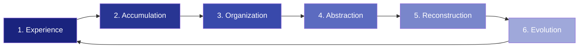
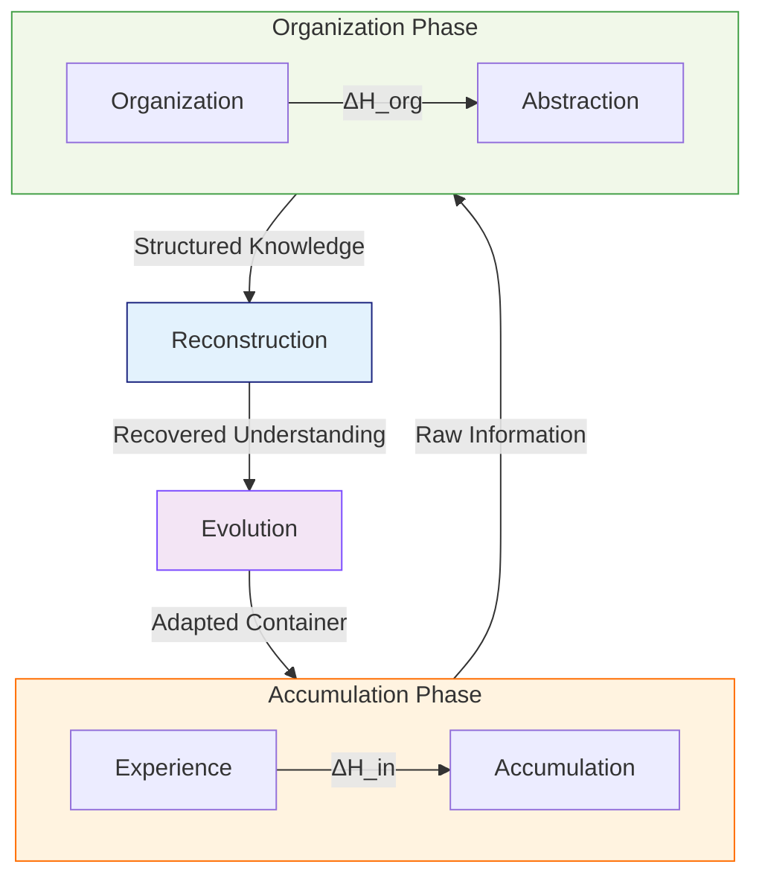
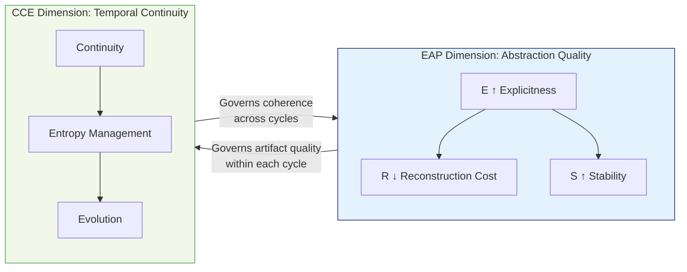
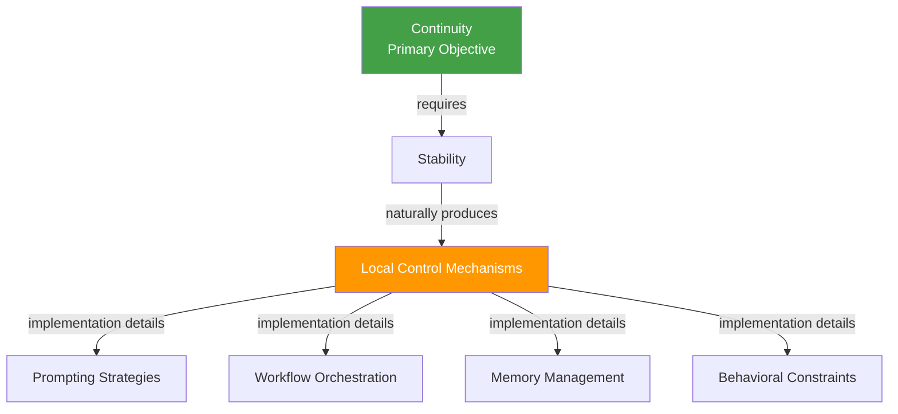

# Cognitive Continuity Engineering (CCE)

> **CCE is the engineering discipline devoted to making cognition persist, evolve, and remain reconstructable over time.**

---

## 1. Introduction

### 1.1 Why a New Discipline?

Humanity is entering an era where cognition is no longer an exclusively biological process. Language models, software agents, and knowledge repositories now participate in cognitive work at scale — but our engineering frameworks still treat cognition as a sequence of discrete events rather than a continuous process.

Existing fields do not address this gap. **[Cognitive Engineering](https://doi.org/10.1002%2F0471028959.sof045)**, as traditionally defined, studies how to design systems that support human cognitive performance during individual tasks — optimizing interfaces, reducing error rates, and improving decision speed. It treats cognition as a **task-level phenomenon**: each interaction is an isolated unit to be optimized.

**Cognitive Continuity Engineering (CCE)** studies a fundamentally different object: cognition as a **continuous dynamic process** whose current state depends upon its entire historical trajectory. Its primary concern is not the optimization of single interactions, but the engineering of systems capable of sustaining coherent cognitive evolution across extended temporal horizons.

This distinction is not academic. Consider:

- A team of developers works with an LLM-powered coding assistant over six months. After the third month, the assistant's context has become so fragmented that it suggests architectures contradicting decisions made in month one. The assistant has no mechanism for **continuity** — it only has mechanisms for individual sessions.
- A research group maintains a shared knowledge base. Over time, entries become duplicated, assumptions become obsolete, and abstractions drift apart without anyone noticing. The knowledge base accumulates **entropy** — not because it was poorly designed for any single task, but because no engineering discipline governs what happens to cognition across time.

These failures are not failures of traditional cognitive engineering. They are failures of **continuity engineering** — a category of problem that no existing discipline systematically addresses.

### 1.2 Why "Continuity" and Not "Memory"?

A design choice worth making explicit: this discipline is called **Cognitive Continuity Engineering**, not Cognitive Memory Engineering.

The distinction is fundamental:

| | Memory (mechanism) | Continuity (property) |
|---|---|---|
| **What it is** | A concrete mechanism for storing and retrieving information | An emergent property of the cognitive system as a whole |
| **Engineering analogy** | Cache in networking — a specific implementation technique | **Connectivity** in networking — the property the entire system is engineered to maintain |
| **Failure mode** | Forgetting specific facts | Losing the ability to reconstruct coherent cognitive state |

In networking, the objective is not to optimize caching — it is to maintain **connectivity**. In control engineering, the objective is not to perfect feedback loops — it is to maintain **stability**. Similarly, CCE's objective is not to maximize memory fidelity — it is to maintain **cognitive continuity**: the property that a cognitive system can persist, evolve, and remain reconstructable over time.

This framing has a crucial consequence: CCE studies **continuity as an engineerable property of cognitive systems** — not Session, Memory, Skill, or Agent as specific mechanisms. Those mechanisms are implementation details of continuity, not the object of study itself.

---

## 2. Core Concepts

### 2.1 Cognitive Container

> **Cognitive Container**
> *A bounded cognitive space within which cognition may accumulate, reorganize, and evolve. The container provides identity, boundaries, persistent memory, operational constraints, and evolutionary history.*

Continuous cognition requires a persistent environment. Without a container — without boundaries that define what belongs and what does not — there is no substrate on which continuity can be maintained.

A Cognitive Container provides five defining properties:

| Property | Function |
|----------|----------|
| **Identity** | Distinguishes this cognitive system from others; provides a stable referent for continuity |
| **Boundaries** | Defines what is inside vs. outside the cognitive space; constrains scope |
| **Persistent Memory** | Retains accumulated cognition across time; the substrate for evolution |
| **Operational Constraints** | Defines what operations are permissible within the container (tools, access, rules) |
| **Evolutionary History** | Records the trajectory of cognitive change; enables reconstruction |

**Example.** A Concrete Cognitive Container (CCC) — the runtime instance of an Abstract Cognitive Container (ACC) — exemplifies this concept. The CCC has a root directory (identity), file-system boundaries (boundaries), persistent session records (persistent memory), a defined set of tools and MSMs (operational constraints), and a git history tracking all changes (evolutionary history). When an agent enters the CCC, it inherits this bounded context; when it leaves, the context persists. Continuity belongs to the container, not to any individual agent.

### 2.2 Cognitive Trajectory

> **Cognitive Trajectory**
> *The temporal sequence of cognitive states within a container, where each state is a function of all prior states. The fundamental unit of analysis in CCE — replacing the discrete "interaction" as the primary object of study.*

Traditional cognitive engineering models cognition as a sequence of independent events — tasks, sessions, conversations. CCE replaces this with the concept of a **trajectory**: a continuous path through cognitive state-space where each state is causally dependent on the preceding states.

Formally, for a cognitive container C over time t₀, t₁, ..., tₙ:

> **C(tₙ) = f(C(tₙ₋₁), Δₙ)**
>
> Where Δₙ is the cognitive delta introduced at time tₙ — new information, decisions, abstractions, or reorganizations.

This means: the current state of the container is not determined by the most recent interaction alone. It is determined by the **entire history** of cognitive deltas applied to the container since its inception. Every interaction modifies the future state of the system — whether intended or not.

**Example.** When an agent makes a design decision within a CCC and records it in a session document, that decision becomes part of C(t). All future agents interacting with the container encounter this decision as part of the container's state. If the decision was poorly documented (low explicitness), future agents will either misinterpret it (divergent trajectory) or spend additional cognitive resources reconstructing the original reasoning (increased reconstruction cost). The trajectory is shaped by every decision, good or bad, explicit or implicit.

---

## 3. Five Fundamental Assumptions

CCE is founded on five assumptions. Each is stated, exemplified, and — where applicable — given a formal expression.

### 3.1 Assumption 1: Cognition is Continuous

> A cognitive system should not be modeled as independent conversations or independent tasks. Cognition is a continuous process whose current state depends upon its historical trajectory.

Every interaction modifies the future state of the system. The fundamental unit of analysis is not an interaction — it is a **cognitive trajectory**.

**Example.** A developer asks an AI assistant "refactor this function." If each request is treated as independent, the assistant may produce a refactoring that conflicts with architectural decisions made in prior sessions. In a CCE framework, the assistant's response is conditioned on the full trajectory — prior design decisions, coding conventions established over time, known constraints — not just the current prompt.

**Formal expression:**

> **C(tₙ) ≠ C(t₀) + ΣΔᵢ** (non-additive)
>
> The container at time tₙ is not the sum of independent deltas. The order, context, and interrelationship of deltas matters.

---

### 3.2 Assumption 2: Cognition Exists Within Bounded Spaces

> Continuous cognition requires a persistent environment. Without bounded spaces — without identity, boundaries, and memory — continuity cannot be maintained.

A Cognitive Container is the necessary substrate. Unbounded cognition disperses; only within defined boundaries can it accumulate and evolve.

**Example.** A Slack channel accumulates messages, but it is not a Cognitive Container. It has no persistent memory structure beyond chronological threads, no mechanism for organizing abstractions, no evolutionary history that can be queried. Knowledge in a Slack channel decays — not because people forget, but because the space itself provides no continuity substrate. Compare this to a well-maintained git repository with structured commit messages, design documents, and an architecture decision record: the latter is a Cognitive Container; the former is not.

---

### 3.3 Assumption 3: Entropy is Intrinsic

> Every continuous cognitive system naturally accumulates entropy. Entropy is an intrinsic property, not an implementation defect.

In thermodynamics, closed systems trend toward disorder. In cognitive systems, the same principle applies — but the manifestations are specific:

| Entropy Type | Manifestation |
|-------------|---------------|
| **Duplication** | The same knowledge exists in multiple locations with slight variations |
| **Obsolescence** | Assumptions that were true at tₙ become false at tₙ₊ₖ without being updated |
| **Conflict** | Abstractions developed in parallel produce contradictory models of the same domain |
| **Fragmentation** | Related knowledge is distributed across disconnected storage locations |
| **Procedural Drift** | Operational procedures accumulate ad-hoc modifications that diverge from documented processes |

**Example.** A family knowledge base contains a document about the home network topology written in January, a second document about the network written in March after a router upgrade, and a third written in June after adding a new VLAN. The first two documents are now partially obsolete, and no single document represents the current state. This is not a failure — it is entropy accumulation, and it requires ongoing organization, not a one-time fix.

**Formal expression:**

> **H(C(tₙ₊₁)) = H(C(tₙ)) + ΔH_in − ΔH_org**
>
> Where H is the entropy of the container, ΔH_in is the entropy introduced by new cognitive deltas (every new piece of information adds some disorder), and ΔH_org is the entropy reduced through active organization.

The objective of CCE is not to eliminate entropy — that is thermodynamically impossible. The objective is to ensure:

> **ΔH_org ≥ ΔH_in** — organization keeps pace with accumulation.

When organization falls behind accumulation, the container's continuity degrades. When organization matches or exceeds accumulation, continuity is maintained.

---

### 3.4 Assumption 4: Reconstruction is More Important than Preservation

> Memory is not defined as the preservation of information. Memory is defined as the capability to reconstruct cognitive state.

This is perhaps CCE's most counterintuitive assumption. Most knowledge management systems are architected around **preservation**: store everything, index it, make it searchable. CCE argues that the engineering objective should instead be **reconstructability**.

Stored artifacts possess value only insofar as they enable future cognition to recover the reasoning structures that originally produced them. A perfectly preserved document whose reasoning cannot be recovered is archival success but engineering failure.

**Example.** A git commit message that reads "fixed bug" preserves the fact that a change was made. But it does not enable reconstruction of the cognitive state that produced the fix — what the bug was, why this approach was chosen, what alternatives were considered and rejected. A commit message that reads "Fix: login timeout regression from #342 — upstream auth service response exceeded 30s gateway timeout; added index on phone_number column to reduce query from 8s to 200ms" enables reconstruction. The latter is CCE-aligned; the former is not.

**Formal expression:**

> **V(artifact) ∝ R_quality(artifact)**
>
> Where V is the functional value of an artifact and R_quality is the degree to which it enables reconstruction of the original cognitive state. Preservation fidelity alone does not determine value.

---

### 3.5 Assumption 5: Cognition is Multi-Agent by Nature

> A cognitive system may consist of multiple participating entities — humans, language models, software agents, external tools, knowledge repositories. Continuity belongs to the cognitive system itself rather than to any individual participant.

Participants may enter or leave while continuity remains preserved within the container.

**Example.** Over the course of a year, a CCC (Concrete Cognitive Container) is used by multiple human family members, several different LLM agent instances, and various automated tools. No single participant was present for the entire year. Yet the container's cognitive trajectory — its accumulated decisions, organized knowledge, evolved abstractions — remains intact and reconstructable. Continuity is a property of the container, not of any participant.

This assumption has a practical consequence: CCE does not need to model individual agent cognition. It only needs to model the cognitive state of the container and how that state evolves through the contributions of any agent. The container is the subject; agents are its operators.

---

## 4. Core Lifecycle

### 4.1 The Six-Stage Cycle

A cognitive container continuously cycles through six stages:

The output of each cycle becomes part of the input of the next. Cognition is modeled as **recursive evolution** rather than repeated initialization.

| Stage | Description | Engineering Concern |
|-------|-------------|---------------------|
| **1. Experience** | New information enters the container (human input, LLM output, external data) | Ingestion fidelity — does the input carry enough structure to be integrated? |
| **2. Accumulation** | Information is stored within the container's memory substrate | Storage integrity — is information stored without loss or corruption? |
| **3. Organization** | Accumulated information is structured, deduplicated, cross-referenced | Entropy management — ΔH_org (see §3.3) |
| **4. Abstraction** | Organized information is compressed into higher-level patterns and principles | Explicitness — are abstractions explicitly encoded or implicitly assumed? |
| **5. Reconstruction** | Future cognition recovers meaning from stored abstractions | Reconstructability — can reasoning structures be recovered from artifacts? |
| **6. Evolution** | The container's structure itself adapts based on accumulated experience | Adaptive coherence — does evolution preserve coherence or introduce drift? |

### 4.2 The Entropy Cycle

The lifecycle can be understood through the lens of entropy management (§3.3):

- **Accumulation Phase** (Experience → Accumulation): ΔH_in increases. New information enters, bringing both signal and noise.
- **Organization Phase** (Organization → Abstraction): ΔH_org counteracts. Structure is imposed, duplicates are removed, abstractions are formed.
- **Reconstruction**: Organized abstractions are tested — can a future agent recover the reasoning?
- **Evolution**: The container adapts. If reconstruction succeeds, the cycle is healthy. If it fails, the container's organizational structures need evolution.

The engineering condition for sustained continuity:

> **ΔH_org ≥ ΔH_in** — organization must at minimum match accumulation.

When this condition holds, the container maintains coherent continuity. When it fails, cognitive debt accumulates — and, like technical debt, compounds over time.

---

## 5. Relationship Topology

### 5.1 CCE and Explicit Abstraction Principle (EAP)

CCE and EAP address different dimensions of cognition:

| | EAP | CCE |
|---|---|---|
| **Core question** | How should knowledge be organized to maximize functional value? | How should organized knowledge continue to evolve without losing coherence? |
| **Unit of analysis** | A cognitive artifact | A cognitive trajectory |
| **Primary variable** | E (Explicitness Degree) | H (Entropy) |
| **Time orientation** | Static — optimal structure at a point in time | Dynamic — sustained coherence across time |
| **Relationship** | EAP governs abstraction | CCE governs continuity |

EAP asks: *given a piece of knowledge, how should it be structured?* CCE asks: *given a structured knowledge base, how should it evolve over time without degrading?*

The two are complementary rather than hierarchical. A container can have high EAP quality (every document is well-structured) but poor CCE (documents drift apart over time, abstractions conflict). Conversely, a container can have good CCE (coherent evolution) while individual artifacts have room for higher explicitness.

**Example.** In a CCC, EAP governs how a single session document is written — are decisions explicitly stated? Are relationships clearly encoded? CCE governs how session documents relate to each other across time — are cross-references maintained? Are obsolete decisions marked? Do later sessions contradict earlier ones? A CCC with excellent individual sessions but no cross-session coherence fails CCE's continuity requirement.

### 5.2 CCE and Information Theory

CCE assumes that every cognitive system is fundamentally constrained by Information Theory. Communication bandwidth, information loss, uncertainty, and entropy establish the theoretical limits of cognition.

Information Theory defines the **boundary conditions** of CCE — the physical limits within which all cognitive engineering must operate. CCE studies the engineering of cognition inside those boundaries.

Key constraints from Information Theory that bound CCE:

| Constraint | CCE Implication |
|------------|-----------------|
| **Channel capacity** | The rate at which information can enter a container is bounded |
| **Lossy compression** | Every abstraction loses information; the question is whether the loss matters for reconstruction |
| **Entropy as uncertainty** | Every container has irreducible uncertainty about its own state |
| **Kolmogorov complexity** | The minimum description length of a container's state is a lower bound on reconstruction cost |

### 5.3 CCE and Control

CCE does not reject control. It treats control as an **emergent engineering mechanism** rather than a primary objective.

Local control naturally appears wherever continuity requires stability. Techniques such as prompting strategies, workflow orchestration, memory management, or behavioral constraints become implementation details of continuity rather than independent engineering goals.

**Within CCE, control exists to preserve continuity — not the reverse.**

This is a critical distinction from traditional control-oriented approaches. If the primary objective is control, then continuity is sacrificed whenever it conflicts with maintaining constraints. If the primary objective is continuity, then control mechanisms are deployed as needed and removed when they obstruct evolution.

---

## 6. Formal Foundations

> This chapter provides information-theoretic formalizations of CCE's core claims. The derivations parallel those in the [EAP theory](https://github.com/tellmewhattodo/theory-eap) but address the temporal dimension that EAP treats as static.

### 6.1 The Cognitive Continuity Condition

Let C be a cognitive container with state space S. At any time t, the container's cognitive state is s(t) ∈ S.

Define **cognitive continuity** as the property that s(t) can be reconstructed from s(t − Δt) for any Δt within the container's operational horizon:

> **Continuity(C) ⟺ ∀t, ∃R such that R(s(t − Δt), artifacts(t − Δt, t)) ≈ s(t)**
>
> Where R is a reconstruction function and artifacts(t − Δt, t) are the stored cognitive artifacts produced between t − Δt and t.

In other words: continuity holds if, given the state at an earlier point and the artifacts produced since then, a future agent can recover a sufficiently close approximation of the current state.

### 6.2 Entropy Dynamics

Define the entropy H of the container at time t as the degree of disorder in its cognitive state:

> **H(C, t) = −Σᵢ p(sᵢ) log p(sᵢ)**
>
> Where p(sᵢ) is the probability that a random retrieval from the container returns state sᵢ. Higher entropy = less predictability = more disorder.

When new information enters the container (accumulation), entropy increases:

> **H(C, t + 1) = H(C, t) + ΔH_in(t) − ΔH_org(t)**
>
> Where:
> - ΔH_in(t) ≥ 0: entropy introduced by new cognitive deltas (information, decisions, modifications)
> - ΔH_org(t) ≥ 0: entropy reduced through active organization (deduplication, structuring, abstraction)

**The Continuity Maintenance Condition:**

> **ΔH_org(t) ≥ ΔH_in(t), ∀t**
>
> Organization must at minimum match accumulation for continuity to be sustained.

If ΔH_org < ΔH_in consistently, entropy grows without bound:

> **lim[t→∞] H(C, t) → ∞** when ΔH_org < ΔH_in

In this regime, the container becomes a "cognitive landfill" — information exists but cannot be effectively retrieved, related, or reconstructed. Continuity is lost, even if all data is technically preserved.

### 6.3 Reconstruction Fidelity

Define reconstruction fidelity F as the information-theoretic similarity between the actual state s(t) and the reconstructed state s'(t):

> **F = I(s(t); s'(t)) / H(s(t))**
>
> Where I(X;Y) is mutual information and H(s(t)) is the entropy of the true state. F ∈ [0, 1].

Reconstruction fidelity depends on two factors:

1. **Artifact quality Q_a**: How much of the original cognitive state is encoded in stored artifacts
2. **Organization level O**: How efficiently the artifacts can be navigated and related

> **F ∝ Q_a · O**
>
> Maximum fidelity requires both high-quality artifacts (EAP's domain) and high organization (CCE's domain).

This formalizes the complementarity between EAP and CCE: EAP governs Q_a (artifact explicitness), CCE governs O (sustained organization across time). Both are necessary; neither is sufficient alone.

### 6.4 The Multi-Agent Invariance Property

For a container with multiple participating agents A₁, A₂, ..., Aₙ, define continuity as **agent-invariant** if the container's state trajectory is independent of which specific agents contributed:

> **C(tₙ) ≈ C'(tₙ) for any agent sequence A'₁, ..., A'ₙ**
>
> In other words: the trajectory depends on *what* was contributed, not *who* contributed it.

This does not mean all agents produce identical output — it means the container's state after agent A₁ does X should be functionally equivalent to its state after agent A₂ does X, assuming the contribution X is semantically equivalent. The container normalizes across agent variation.

**Example.** Two different LLM agents summarize the same design discussion within the same CCC. Their summaries may use different words, but the container's state — its organized knowledge, its cross-references, its abstractions — should converge to the same structure regardless of which agent produced the summary. If it does not, the container lacks multi-agent invariance, and continuity is fragile (dependent on specific agents).

### 6.5 The Evolution vs. Accumulation Theorem

**Theorem.** A cognitive container that only accumulates without evolving (no abstraction, no reorganization) will eventually lose continuity.

**Proof.**

1. By §6.2, H(C, t) grows with each accumulation event: ΔH_in > 0.
2. Without organization: ΔH_org = 0.
3. Therefore H(C, t) → ∞ as t → ∞.
4. As H → ∞, the reconstruction function R becomes intractable: the search space for relevant information grows exponentially.
5. An intractable R means reconstruction fails for sufficiently large Δt.
6. By §6.1 definition, continuity is lost.

**Corollary.** Evolution (stage 6 of the lifecycle) is not optional — it is mathematically necessary for long-term continuity. **Accumulation without evolution is indistinguishable from decay.**

---

## 7. Engineering Objective

### 7.1 What CCE Does Not Optimize

To understand what CCE optimizes, it is clarifying to state what it does not:

| Not the objective | Why |
|-------------------|-----|
| **Maximize intelligence** | Intelligence is a property of agents, not containers. A container can maintain continuity with agents of varying intelligence. |
| **Maximize memory** | Memory without structure is just storage. A container with perfect memory but no organization is a landfill, not a cognitive system. |
| **Maximize control** | Control is a mechanism for preserving continuity, not an end in itself. Over-controlling impedes evolution. |

### 7.2 The Actual Engineering Objective

> **Maximize the long-term continuity of coherent cognition under bounded resources and irreversible information constraints.**

Breaking this down:

- **Long-term**: Not optimizing for the next interaction, but for the trajectory over indefinite time horizons
- **Coherent**: Not just preserving information, but maintaining internal consistency
- **Bounded resources**: Storage, computation, and attention are finite
- **Irreversible information constraints**: Information theory sets hard limits that engineering cannot overcome, only operate within

### 7.3 Continuity as an Engineerable Property

The central thesis of CCE — carrying forward the user's original insight — is:

> **Continuity is an engineerable property of cognitive systems, not a byproduct of specific mechanisms.**

Just as:
- Networking engineers **connectivity**, not individual packets
- Control engineers engineer **stability**, not individual feedback loops
- Database engineers engineer **consistency**, not individual writes

CCE engineers **continuity** — not Session, Memory, Skill, or Agent. Those are implementation mechanisms. Continuity is the property they collectively produce, and it can be measured, degraded, restored, and optimized — just like any other engineering property.

### 7.4 Open Research Questions

CCE, as a nascent discipline, identifies — but does not yet answer — the following questions:

1. **Bounding**: How should cognitive spaces be bounded? What is the optimal granularity of a container?
2. **Persistence**: How should cognition persist across time? What storage substrates and encoding schemes optimize for reconstructability?
3. **Entropy measurement**: How should entropy be measured and managed? Can we define quantitative metrics for cognitive entropy akin to Shannon entropy?
4. **Abstraction evolution**: How should abstractions evolve over time? When should an abstraction be retired vs. revised?
5. **Interruption recovery**: How should cognitive state be reconstructed after interruption? What is the minimum artifact set required for full state recovery?
6. **Multi-agent continuity**: How should multiple cognitive agents maintain shared continuity? What protocols prevent agent-specific drift?
7. **Adaptive coherence**: How should long-term cognition remain coherent while remaining adaptive? What is the optimal balance between stability and plasticity?

---

## References

1. Roth, E. M. (2008). Cognitive Engineering. In *Wiley Encyclopedia of Computer Science and Engineering*. https://doi.org/10.1002/0471028959.sof045
2. Shannon, C. E. (1948). A Mathematical Theory of Communication. *Bell System Technical Journal*, 27(3), 379–423.
3. [Explicit Abstraction Principle (EAP)](https://github.com/tellmewhattodo/theory-eap) — the complementary theory governing cognitive artifact quality within individual cycles.

---

> *CCE is the engineering discipline devoted to making cognition persist, evolve, and remain reconstructable over time.*
