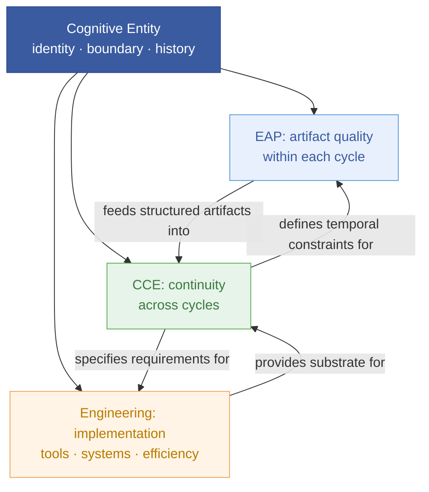
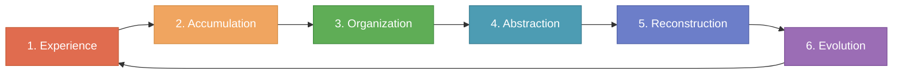
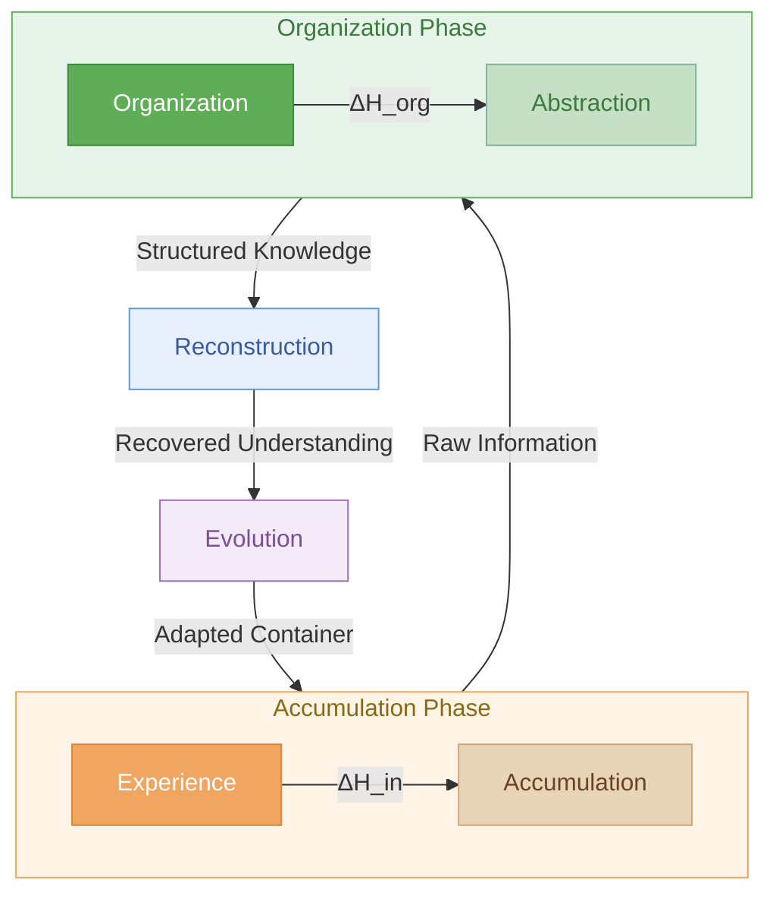
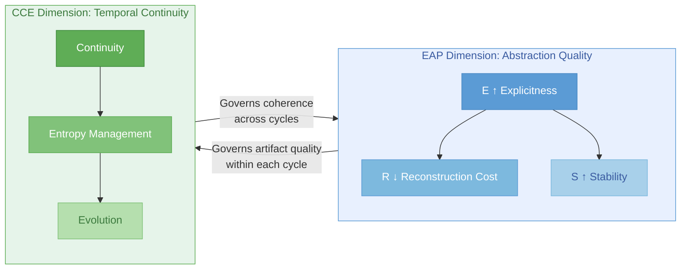
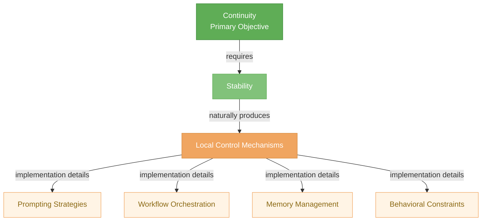

# 认知连续性工程 (CCE)

> **认知连续性工程是在有限资源与不可逆不确定性的约束下，维持一个认知实体的身份、可达性与演化能力的工程学科。**

---

## 1. 引言

### 1.1 为什么需要一门新学科？

人类正在进入一个认知不再仅仅是生物过程的时代。语言模型、软件智能体和知识库已经大规模地参与到认知工作中——然而我们的工程框架仍然将认知视为一系列离散事件，而非一个连续过程。

现有学科并未填补这一空白。传统意义上的**[认知工程 (Cognitive Engineering)](https://doi.org/10.1002%2F0471028959.sof045)** [^1] 研究的是如何设计支持人类在单次任务中认知表现的系统——优化界面、降低错误率、提升决策速度。它将认知视为一种**任务级现象**：每一次交互都是一个待优化的独立单元。

**认知连续性工程 (CCE)** 研究的是一个根本不同的对象：将认知视为一种**连续的动态过程**，其当前状态取决于其全部历史轨迹。它的核心关注点不是单次交互的优化，而是工程化那些能够在扩展的时间尺度上维持连贯认知演化的系统。

这一区别并非学究式的。考虑以下场景：

- 一个开发团队在六个月内与 LLM 驱动的编程助手协作。到第三个月，助手的上下文已经变得如此碎片化，以至于它建议的架构与第一个月做出的决策相矛盾。这个助手没有**连续性**机制——它只有单次会话的机制。
- 一个研究团队维护着一个共享知识库。随着时间的推移，条目被重复创建，假设变得过时，抽象层之间产生漂移而无人察觉。知识库积累了**熵**——不是因为它在任何单次任务中设计得不好，而是因为没有一门工程学科来治理认知在时间维度上发生的变化。

这些失败不是传统认知工程的失败。它们是**连续性工程**的失败——这是一类现有学科尚未系统性地应对的问题。

### 1.2 为什么叫"连续性"而非"记忆"？

一个值得显式说明的设计选择：这门学科之所以叫**认知连续性工程**，而非认知记忆工程，是有意为之的。

这一区分是根本性的：

| | 记忆（机制） | 连续性（性质） |
|---|---|---|
| **是什么** | 存储和检索信息的具体机制 | 认知系统整体的涌现性质 |
| **工程类比** | 网络工程中的缓存——一种具体的实现技术 | 网络工程中的**连通性 (connectivity)** [^2]——整个系统被工程化所要维护的性质 |
| **失败模式** | 遗忘特定事实 | 丧失重建连贯认知状态的能力 |

在网络工程中，目标不是优化缓存——而是维护**连通性**。在控制工程中，目标不是完善反馈回路——而是维护**稳定性 (stability)** [^3]。类似地，CCE 的目标不是最大化记忆的保真度——而是维护**认知连续性**：即一个认知系统能够在时间中持续存在、演化并保持可重建的性质。

这一框架有一个关键推论：CCE 研究的是**连续性作为认知系统的一种可工程化性质**——而非会话 (Session)、记忆 (Memory)、技能 (Skill) 或智能体 (Agent) [^4] 这些具体机制。这些机制是连续性的实现细节，而非研究对象本身。

[^1]: Cognitive Engineering 在英文中是一个已有学科名称，与 CCE 是不同的学科。
[^2]: Connectivity 在网络工程中指网络节点之间能够建立通信连接的性质，是网络工程的核心目标属性。
[^3]: Stability 在控制工程中指系统受到扰动后能够恢复到平衡状态的性质。
[^4]: Agent 在本文中指任何参与认知活动的实体（人类、LLM、软件等），非专指 AI agent。

### 1.3 理论域边界

CCE 不声称回答所有关于认知的问题。一个关键的理论操作是划定清晰的域边界：

| 问题 | 所属域 |
|------|--------|
| 如何表达思维？ | **EAP**（显式抽象原则） |
| 如何组织知识？ | **EAP** |
| 认知如何跨越时间持续？ | **CCE** |
| 如何实现工具和系统？ | **Serenity**（或任何具体的工程平台）[^5] |
| 如何提升局部任务效率？ | **工程学**（传统的领域特定优化） |
| 意识是否存在？AI 是否有生命？ | **哲学/科学**——明确处于 CCE 的范畴之外 |

这种域划分不仅是分类学上的——它是**理论卫生 (theoretical hygiene)** [^6]。通过声明 CCE 不研究什么，该理论避免了：

- **范畴蔓延 (scope creep)** [^7]：CCE 不需要解决意识问题才能被认为是有效的
- **包含性模糊 (vagueness by inclusion)** [^8]：CCE 不是"关于认知的一切的理论"
- **过早整合 (premature integration)** [^9]：CCE 与 EAP 是互补的邻居，而非上下层级——各自有各自的研究对象

这些域之间的关系可以可视化为对一个共享认知实体的相邻治理关切：

关键洞察：**CCE 研究的是认知实体的连续性——而非其个体产物的质量（EAP 的域）、其工具的实现（工程学的域），当然也非其意识的本质（哲学的域）。**

[^5]: Serenity 是本文作者维护的一个具体认知容器实例，是 CCE 理论的工程化实践平台。
[^6]: Theoretical hygiene 指理论在划定边界时的清晰性和自洽性——一个理论越清晰地声明自己的"不研究什么"，就越健康。
[^7]: Scope creep 原为项目管理术语，在此指理论范畴不受控地扩张到不应覆盖的领域。
[^8]: Vagueness by inclusion 指因试图覆盖过多而导致边界模糊，使理论失去可操作性的现象。
[^9]: Premature integration 指在各自理论尚未充分展开时过早地将两个理论合并为一个层级体系。

---

## 2. 核心概念

### 2.1 认知容器

> **认知容器 (Cognitive Container)**
> *一个有界的认知空间，认知可以在其中积累、重组和演化。容器提供身份、边界、持久记忆、操作约束和演化历史。*

连续性认知需要一个持久的环境。没有容器——没有定义什么属于、什么不属于的边界——就没有连续性得以维系的基础。

一个认知容器提供五个定义性属性：

| 属性 | 功能 |
|------|------|
| **身份 (Identity)** | 将此认知系统与其他系统区分开来；为连续性提供一个稳定的参照物 |
| **边界 (Boundaries)** | 定义什么在认知空间之内、什么在外；约束范畴 |
| **持久记忆 (Persistent Memory)** | 跨时间保留积累的认知；演化的基础 |
| **操作约束 (Operational Constraints)** | 定义容器内允许哪些操作（工具、访问权限、规则） |
| **演化历史 (Evolutionary History)** | 记录认知变化的轨迹；使重建成为可能 |

**示例。** 一个具体认知容器 (CCC) [^10] ——抽象认知容器 (ACC) 的运行时实例——阐释了这一概念。CCC 有一个根目录（身份）、文件系统边界（边界）、持久会话记录（持久记忆）、一组定义好的工具和 MSM [^11]（操作约束）、以及记录所有变化的 git 历史（演化历史）。当一个智能体进入 CCC 时，它继承了这个有界上下文；当它离开时，上下文保持不变。连续性属于容器，不属于任何个体智能体。

### 2.2 认知轨迹

> **认知轨迹 (Cognitive Trajectory)**
> *容器内认知状态的时间序列，其中每个状态是所有先前状态的函数。CCE 的基本分析单元——取代离散的"交互"成为首要研究对象。*

传统认知工程将认知建模为一连串独立事件——任务、会话、对话。CCE 以**轨迹**的概念取而代之：一条穿越认知状态空间的连续路径，其中每个状态都因果地依赖于前面的状态。

形式上，对于认知容器 C 在时间 t₀, t₁, ..., tₙ 上：

> **C(tₙ) = f(C(tₙ₋₁), Δₙ)**
>
> 其中 Δₙ 是在时间 tₙ 引入的认知增量 [^12]——新信息、决策、抽象或重组。

这意味着：容器的当前状态并非仅由最近一次交互决定。它是由自容器创建以来施加于其上的**全部历史**认知增量决定的。每一次交互都会修改系统的未来状态——无论是否有意。

**示例。** 当一个智能体在 CCC 内做出一个设计决策并记录在会话文档中，该决策就成为 C(t) 的一部分。所有未来与容器交互的智能体都会将这一决策作为容器状态的一部分来对待。如果该决策记录得不好（显式度低），未来的智能体要么会误解它（轨迹发散），要么会花费额外的认知资源来重建原始推理（重建成本增加）。轨迹由每一个决策塑造——无论好坏、显式或隐式。

### 2.3 认知身份边界

> **认知身份边界 (Cognitive Identity Boundary)**
> *定义"哪个连续实体正在演化"的边界。CCE 的主体不是生物智能体——而是任何具有跨时间持久身份边界的认知实体。*

CCE 不需要回答哲学问题"谁在思考？"那属于心灵哲学。CCE 需要回答的是一个更窄的、工程性的问题：**"哪个连续实体正在演化？"**

认知身份边界是使某物成为*一个东西*并持续存在的依据：

| 实体 | 身份边界 | CCE 对象 |
|------|----------|----------|
| **人** | 生物连续性 + 自传体记忆 | 一段生命轨迹 |
| **项目** | 共享目标、产物和机构记忆 | 一段项目轨迹 |
| **国家** | 法律连续性、文化记忆、历史叙事 | 一段文明轨迹 |
| **叙事** | 故事元素在多次讲述中的内部连贯性 | 一段叙事轨迹 |
| **CCC** | 根目录、工具集、会话历史 | 一段容器轨迹 |

这一抽象的优雅之处在于其普适性：**CCE 的"主体"不是活的主体——而是一个具有连续边界的认知实体。**"一个"这个词——*一个*公司、*一个*文明、*一个*故事——在做关键的工作。语言不仅仅*描述*边界；语言*参与创造*边界。当我们说"一个项目"时，我们不仅是在贴一个已存在类别的标签——我们是在构造那个使连续性工程成为可能的边界。

这直接关联到 EAP 对语言作为接口的分析（EAP 理论第 3 章）。语言构造认知边界，CCE 则为这些边界工程化连续性。两种理论共享一个共同的基础：认识到语言结构不是被动的描述，而是主动的边界构造操作。

**工程推论。** 一个认知身份边界必须：

1. **足够稳定**以作为持久的参照物——如果边界不可预测地变动，连续性在基础层面就被削弱了
2. **足够可渗透**以接纳新信息、新智能体和重组——一个不可渗透的边界阻止了演化
3. **被显式编码**——一个隐式边界（例如"我们都清楚这个项目是什么"）无法被工程化；必须被外部化为一个已定义的结构

[^10]: CCC (Concrete Cognitive Container) 是抽象认知容器 (ACC: Abstract Cognitive Container) 的具体运行时实例。
[^11]: MSM (Mech & Semi-Mech) 是 Serenity 系统中可执行单元的分类：Mech 为纯确定性工具，Semi-Mech 为含 LLM 决策点的工具。
[^12]: Delta (Δ) 在此借自数学符号，表示一个增量或变化量。认知增量 (cognitive delta) 指认知状态中的一次变更。

---

## 3. 五项基本假设

CCE 建立在五项假设之上。每一项都被陈述、举例说明，并在适用时给出形式表达。

### 3.1 假设一：认知是连续的

> 认知系统不应被建模为独立的对话或独立的任务。认知是一个连续的过程，其当前状态取决于其历史轨迹。

每一次交互都会修改系统的未来状态。基本分析单元不是一次交互——而是一条**认知轨迹**。

**示例。** 一个开发者让 AI 助手"重构这个函数"。如果每一次请求都被视为独立的，助手可能产生一个与之前会话中所做的架构决策相冲突的重构方案。在 CCE 框架中，助手的回应条件是完整轨迹——先前的设计决策、随时间建立的编码惯例、已知的约束——而不仅仅是当前提示词。

**形式表达：**

> **C(tₙ) ≠ C(t₀) + ΣΔᵢ**（非加性）
>
> 容器在时间 tₙ 的状态不是独立增量的简单求和。增量的顺序、上下文和相互关系是重要的。

---

### 3.2 假设二：认知存在于有界空间中

> 连续性认知需要一个持久的环境。没有有界空间——没有身份、边界和记忆——连续性就无法维系。

认知容器是必要的基础。无界的认知会消散；只有在已定义的边界内，它才能积累和演化。

**示例。** 一个 Slack 频道会积累消息，但它不是一个认知容器。它没有超越按时间排列的线程的持久记忆结构，没有组织抽象的机制，没有可被查询的演化历史。Slack 频道中的知识会衰减——不是因为人们忘记了，而是因为空间本身不提供连续性基础。将其与一个维护良好的 git 仓库（带有结构化的提交消息、设计文档和架构决策记录）进行对比：后者是一个认知容器；前者不是。

---

### 3.3 假设三：熵是内禀的

> 每一个连续的认知系统都会自然地积累熵。熵是一种内禀属性，而非实现缺陷。

在热力学中，封闭系统趋向于无序。在认知系统中，同样的原理适用——但表现是特定的：

| 熵类型 | 表现 |
|--------|------|
| **重复 (Duplication)** | 相同知识存在于多个位置，带有微小差异 |
| **过时 (Obsolescence)** | 在 tₙ 时成立的假设在 tₙ₊ₖ 时变为错误，但未更新 |
| **冲突 (Conflict)** | 并行发展的抽象对同一领域产生矛盾的模型 |
| **碎片化 (Fragmentation)** | 相关知识分布在不连通的存储位置之间 |
| **过程漂移 (Procedural Drift)** | 操作流程积累临时修改，与记录在案的流程产生分歧 |

**示例。** 一个家庭知识库包含一份 1 月编写的家庭网络拓扑文档、一份 3 月路由器升级后编写的网络文档、以及一份 6 月新增 VLAN 后编写的第三份文档。前两份现已部分过时，没有单一文档代表当前状态。这不是失败——这是熵的积累，需要持续的整理，而非一次性修复。

#### 3.3.1 操作化认知熵

一个关键的区分：CCE 不度量**总体认知熵 (Total Cognitive Entropy)** [^13]——即容器整体的绝对信息论意义上的无序度。该量既不可观测也不可操作。维基百科有巨大的总体熵，但这并不能告诉我们它是否是一个健康的认知容器。

CCE 关注的是**操作化认知熵 (Operational Cognitive Entropy)** [^14]：

> **操作化认知熵**
> *一个智能体在容器内完成一项任务目标所需付出的有效认知成本。它度量的不是"存在多少无序"，而是"多少无序阻碍了行动"。*

工程不度量不可操作的变量。桥梁工程师不度量桥梁的总原子振动——她度量的是载荷点的应力。类似地，CCE 仅度量影响**任务完成成本**的熵：

| 概念 | 定义 | 工程相关性 |
|------|------|------------|
| **总体认知熵** | 所有存储信息的绝对无序度 | 不可度量；不可操作 |
| **操作化认知熵** | 因无序而增加的任务完成认知成本 | 可通过智能体表现度量；可直接操作 |

一个认知容器的健康，不由它包含多少信息来度量，而由智能体是否仍能在合理成本内完成任务来度量。一个有五十份文档的精心维护的工程项目，可能比维基百科健康得多——因为其操作化认知熵很低：智能体快速找到所需，抽象层保持连贯，重建成本是有界的。

这一重新定向为 CCE 提供了一个具体的评价标准：

> **可达性维护 (accessibility maintenance)** [^15]——当操作化认知熵保持在智能体无法再有效运作的阈值之下时，容器是健康的。

CCE 不追求全知。它追求**可达 (reachability)**。

**形式表达：**

> **H_op(C, t) = cost(task | C, t) − cost(task | ideal)**
>
> 操作化熵 H_op 在时间 t 是容器 C 中完成任务的多余认知成本，相较于一个零无序的理想化容器。H_op 是我们度量和管理的对象。总体熵 H_total 是一个没有工程效用的理论构造。

CCE 的目标不是消除熵——这在热力学上是不可能的。目标是维持：

> **H_op(C, t) ≤ H_critical**——操作化熵保持在任务完成变得不可行的阈值之下。

当整理与积累同步时，操作化熵保持有界，连续性得以维持。当整理落后于积累时，操作化熵增长，可达性衰减，连续性退化——即使所有数据在技术上都得到了保存。

[^13]: Total Cognitive Entropy 指容器内所有认知元素的绝对无序程度，出于理论完整性的考虑而定义，但工程上不可用。
[^14]: Operational 在此处的精确含义是"与任务执行操作相关的"，非"可运行的"；Operational Cognitive Entropy 衡量的是无序在多大程度上妨碍了实际操作。
[^15]: Accessibility 在此指信息对智能体的可触达程度——不仅包括"是否存在"，更包括"能否在合理认知成本内被找到、理解和关联"。中文"可达性"也常用于网络和系统设计。

---

### 3.4 假设四：重建优于保存

> 记忆不被定义为信息的保存。记忆被定义为重建认知状态的能力。

这或许是 CCE 最反直觉的假设。大多数知识管理系统围绕**保存**来构建：存储一切、索引、使之可搜索。CCE 主张工程目标应当是**可重建性 (reconstructability)** [^16]。

被存储的产物只有在能够使未来的认知恢复最初产生它们的推理结构时，才具有价值。一份被完美保存的文档，如果其推理无法被恢复，是档案意义上的成功，但却是工程意义上的失败。

**示例。** 一条写着"修了 bug"的 git 提交消息保存了做出更改这一事实。但它不能使人重建产生这一修复的认知状态——bug 是什么、为什么选择这种方案、考虑了哪些替代方案并予以拒绝。一条写着"Fix: login timeout regression from #342 — upstream auth service response exceeded 30s gateway timeout; added index on phone_number column to reduce query from 8s to 200ms"的提交消息则使人可以重建。后者是 CCE 对齐的；前者不是。

**形式表达：**

> **V(artifact) ∝ R_quality(artifact)**
>
> 其中 V 是一个产物的功能价值，R_quality 是它使人能够重建原始认知状态的程度。仅保存保真度不决定价值。

#### 3.4.1 遗忘作为可达性衰减

重建优于保存的一个推论：**遗忘不是删除——而是丧失实际可达性。**

大多数记忆系统将遗忘建模为一个二元操作：

> `删除 = 遗忘`

这既过于简化又具有误导性。在认知系统中——无论生物的还是工程化的——信息很少被*抹除*。它变得**实际上不可达**：信息仍然存在于容器的某处，但检索、解释并将其关联到当前上下文的成本超过了智能体愿意或能够支付的门限。

这可以被形式化为**认知可达性衰减 (Cognitive Accessibility Decay)** [^17]：

> **A(artifact, t) = A₀ · e^(−λt)**
>
> 其中 A 是一个产物在时间 t 的可达性，A₀ 是其初始可达性（索引质量、交叉引用密度、显式度），λ 是由容器的组织性维护程度决定的衰减率。

衰减率 λ 是关键工程变量：

| λ 值 | 条件 | 结果 |
|------|------|------|
| λ ≈ 0 | 保持活跃的组织性维护 | 产物无限期保持可达 |
| λ > 0, 较小 | 周期性组织 | 产物缓慢退化；仍可恢复 |
| λ > 0, 较大 | 无组织 | 产物变为实际不可达——功能上被遗忘，尽管技术上是保存的 |

这一模型避免了将删除等同于遗忘的陷阱。它还暗示 CCE 处理记忆的方法根本上关乎**管理可达性衰减率**——不是决定保留什么或删除什么，而是工程化那些使已存储的认知保持可达的条件。

[^16]: Reconstructability 指从被存储的产物中恢复原始推理结构的能力，是 CCE 评价产物价值的核心标准。
[^17]: Cognitive Accessibility Decay 是 CCE 中描述信息随组织维护不足而逐渐变得不可达的过程的形式模型。

---

### 3.5 假设五：认知本质上是多智能体的

> 一个认知系统可以由多个参与实体组成——人类、语言模型、软件智能体、外部工具、知识库。连续性属于认知系统本身，而非任何个体参与者。

参与者可以进入或离开，而连续性在容器中得到保持。

**示例。** 在一年时间里，一个 CCC 被多位家庭成员、多个不同的 LLM 智能体实例以及各种自动化工具所使用。没有单一参与者参与了全年。然而容器的认知轨迹——其积累的决策、组织化的知识、演化后的抽象——仍然完整且可重建。连续性是容器的一个性质，而非任何参与者的。

这一假设有一个实际推论：CCE 不需要建模个体智能体的认知。它只需要建模容器的认知状态以及该状态如何通过任何智能体的贡献而演化。容器是主体；智能体是其操作者。

---

## 4. 核心生命周期

### 4.1 六阶段循环

一个认知容器持续循环如下六个阶段：

每个循环的输出成为下一个循环输入的一部分。认知被建模为**递归演化**而非重复初始化。

| 阶段 | 描述 | 工程关切 |
|------|------|----------|
| **1. 经验 (Experience)** | 新信息进入容器（人类输入、LLM 输出、外部数据） | 摄取保真度——输入是否携带足够结构以供整合？ |
| **2. 积累 (Accumulation)** | 信息被存储进容器的记忆基础 | 存储完整性——信息是否被无损失、无损坏地存储？ |
| **3. 组织 (Organization)** | 积累的信息被结构化、去重、交叉引用 | 熵管理——ΔH_org（见 §3.3） |
| **4. 抽象 (Abstraction)** | 组织化的信息被压缩为更高层次的模式和原则 | 显式度——抽象是被显式编码还是隐式假设？ |
| **5. 重建 (Reconstruction)** | 未来的认知从已存储的抽象中恢复意义 | 可重建性——推理结构能否从产物中恢复？ |
| **6. 演化 (Evolution)** | 容器本身的结构基于积累的经验进行适应 | 自适应连贯性——演化是保持连贯还是引入漂移？ |

### 4.2 熵循环

可以通过熵管理的透镜来理解该生命周期（§3.3）：

- **积累阶段**（经验 → 积累）：ΔH_in 增加。新信息进入，同时带来信号和噪声。
- **组织阶段**（组织 → 抽象）：ΔH_org 起抵消作用。施加结构，去除重复，形成抽象。
- **重建**：被组织化的抽象接受检验——未来智能体能否恢复推理？
- **演化**：容器适应变化。如果重建成功，循环是健康的。如果失败，容器的组织结构需要演化。

维持连续性的工程条件：

> **ΔH_org ≥ ΔH_in**——组织必须至少与积累同步。

当此条件成立时，容器维持连贯的连续性。当它失败时，认知债务积累——而且像技术债务一样，随时间复利。

---

## 5. 关系拓扑

### 5.1 CCE 与显式抽象原则 (EAP)

CCE 与 EAP 处理认知的不同维度：

| | EAP | CCE |
|---|---|---|
| **核心问题** | 知识应如何被组织以最大化功能价值？ | 有组织的知识应如何在时间中持续演化而不丧失连贯性？ |
| **分析单元** | 一个认知产物 | 一条认知轨迹 |
| **首要变量** | E（显式度） | H_op（操作化认知熵） |
| **时间取向** | 静态——在某一时间点上的最优结构 | 动态——跨时间的持续连贯性 |
| **健康度量** | E↑ R↓ S↑（产物质量） | 可达性维持在 H_critical 之下（容器生存能力） |
| **关系** | EAP 治理抽象 | CCE 治理连续性 |

EAP 问：*给定一段知识，它应如何被结构化？* CCE 问：*给定一个有结构的知识库，它应如何随时间演进而又不在质量上退化？*

两者是互补的而非层级的。一个容器可以有很高的 EAP 质量（每份文档都结构良好）但 CCE 很差（文档随时间彼此漂移，抽象层冲突）。反之，一个容器可以有很好的 CCE（连贯的演化）而个体产物在显式度上仍有提升空间。

**示例。** 在一个 CCC 中，EAP 治理单次会话文档的写法——决策是否被显式陈述？关系是否被清晰编码？CCE 治理会话文档之间的跨时间关系——交叉引用是否被维护？过时决策是否被标记？后来的会话是否与先前的矛盾？一个有个体会话文档质量优秀但没有跨会话连贯性的 CCC 未能满足 CCE 的连续性要求。

### 5.2 CCE 与信息论

CCE 假设每一个认知系统在根本上都受到信息论的约束。通信带宽、信息损失、不确定性和熵建立了认知的理论极限。

信息论定义了 CCE 的**边界条件**——所有认知工程必须在其内运作的物理极限。CCE 研究的是在这些边界之内的认知工程。

约束 CCE 的信息论关键约束：

| 约束 | CCE 含义 |
|------|----------|
| **信道容量 (Channel capacity)** | 信息进入容器的速率是有界的 |
| **有损压缩 (Lossy compression)** | 每一次抽象都会丢失信息；问题在于该损失对重建是否重要 |
| **熵即不确定性 (Entropy as uncertainty)** | 每个容器对其自身状态都有不可约的不确定性 |
| **柯尔莫哥洛夫复杂度 (Kolmogorov complexity)** [^18] | 容器状态的最小描述长度是重建成本的下界 |

### 5.3 CCE 与控制

CCE 不拒绝控制。它将控制视为一种**涌现的工程机制**而非首要目标。

局部控制自然地出现在任何连续性需要稳定性的地方。提示策略、工作流编排、记忆管理或行为约束等技术变成了连续性的实现细节，而非独立的工程目标。

**在 CCE 中，控制的存在是为了维护连续性——而非相反。**

这是与传统控制导向方法的关键区别。如果首要目标是控制，那么每当保持约束与连续性冲突时，连续性就会被牺牲。如果首要目标是连续性，那么控制机制按需部署，在阻碍演化时被移除。

[^18]: Kolmogorov complexity 指描述一个对象所需的最短程序长度，信息论中用于度量对象的信息含量下界。

---

## 6. 形式基础

> 本章提供 CCE 核心主张的信息论形式化。推导方式与 [EAP 理论](https://github.com/tellmewhattodo/theory-eap)平行，但处理的是 EAP 视为静态的时间维度。

### 6.1 认知连续性条件

设 C 为一个认知容器，状态空间为 S。在任意时间 t，容器的认知状态为 s(t) ∈ S。

定义**认知连续性**为：对于容器操作时限内的任意 Δt，s(t) 可以从 s(t − Δt) 重建：

> **Continuity(C) ⟺ ∀t, ∃R such that R(s(t − Δt), artifacts(t − Δt, t)) ≈ s(t)**
>
> 其中 R 为重建函数，artifacts(t − Δt, t) 是 t − Δt 到 t 之间产生的已存储认知产物。

换言之：如果给定早期状态和此后产生的产物，未来智能体能够恢复当前状态的足够接近的近似，则连续性成立。

### 6.2 熵动力学

定义**操作化认知熵** H_op 为容器无序度对任务完成施加的多余认知成本：

> **H_op(C, t) = cost(task | C, t) − cost(task | C_ideal)**
>
> 其中 C_ideal 是一个具有相同信息内容但零无序（完美组织、完全交叉引用、无重复）的假设容器。H_op 度量的是*可操作*的无序——那部分真正阻碍认知的熵。

此定义刻意排除了**总体认知熵** H_total，后者度量容器整体的绝对无序度。H_total 是一个理论构造——它不可度量（复杂容器的完整状态不可观测），且即使可度量也不可操作（知道总无序度并不告诉你在哪里组织）。工程仅度量可操作的变量。

当新信息进入容器（积累），操作化熵发生变化：

> **H_op(C, t + 1) = H_op(C, t) + ΔH_in(t) − ΔH_org(t)**
>
> 其中：
> - ΔH_in(t) ≥ 0：新认知增量引入的操作化熵——若不经组织会增加任务完成成本的新信息
> - ΔH_org(t) ≥ 0：通过主动组织减少的操作化熵——降低任务完成成本的结构化、去重、交叉引用

**连续性维护条件：**

> **ΔH_org(t) ≥ ΔH_in(t), ∀t**
>
> 组织必须至少与积累同步，以使操作化熵保持有界。

如果 ΔH_org < ΔH_in 持续发生，操作化熵无界增长：

> **lim[t→∞] H_op(C, t) → ∞** 当 ΔH_org < ΔH_in

在此状态下，容器变成一个"认知垃圾填埋场" [^19]——信息存在但无法被有效检索、关联或重建。任务完成成本持续上升直至智能体无法再运作。连续性丧失，不是因为信息消失了，而是因为它变得**实际不可达**（§3.4.1）。

**临界阈值：**

> **连续性得以维护 ⟺ H_op(C, t) ≤ H_critical, ∀t**
>
> 其中 H_critical 是智能体在可接受成本内无法再完成任务的操化熵水平。H_critical 是域特定的：一个需求快速变化的软件项目具有更低的 H_critical（对无序的容忍度更低），而一个稳定的档案系统则相对更高。

该模型澄清了为什么"总信息量"不是认知容器的健康度量。一个容器可以有海量信息（高 H_total）但低操作化熵（组织良好、高度可达）。反之，一个容器可以有适度信息但高操作化熵（碎片化、重复、不连贯）。CCE 评估后者而非前者。

[^19]: Cognitive landfill 是 CCE 中用来描述因缺乏组织而变得实质上不可用的认知容器的比喻性术语。

### 6.3 重建保真度

定义重建保真度 F 为实际状态 s(t) 与重建状态 s'(t) 之间的信息论相似度：

> **F = I(s(t); s'(t)) / H(s(t))**
>
> 其中 I(X;Y) 为互信息，H(s(t)) 为真实状态的熵。F ∈ [0, 1]。

重建保真度取决于两个因素：

1. **产物质量 Q_a**：原始认知状态有多少被编码进已存储的产物
2. **组织水平 O**：产物的导航和关联效率有多高

> **F ∝ Q_a · O**
>
> 最大保真度既需要高质量产物（EAP 的域），也需要高组织水平（CCE 的域）。

这形式化了 EAP 与 CCE 的互补性：EAP 治理 Q_a（产物显式度），CCE 治理 O（跨时间的持续组织）。两者都是必要的；单独一个都不充分。

### 6.4 多智能体不变性

对于一个有多个参与智能体 A₁, A₂, ..., Aₙ 的容器，如果容器状态的轨迹独立于具体参与的是哪些智能体，则连续性具有**智能体不变性 (agent-invariant)** [^20]：

> **C(tₙ) ≈ C'(tₙ) for any agent sequence A'₁, ..., A'ₙ**
>
> 换言之：轨迹取决于贡献了*什么*，而非*谁*贡献了它。

这不意味着所有智能体产生相同输出——它意味着智能体 A₁ 执行 X 后容器的状态，在功能上应当等价于智能体 A₂ 执行 X 后的状态，假设贡献 X 在语义上等价。容器在智能体变异之间实现了归一化。

**示例。** 两个不同的 LLM 智能体在同一个 CCC 内对同一个设计讨论进行总结。它们的总结可能用词不同，但容器的状态——其组织化的知识、交叉引用、抽象层——应该收敛到相同的结构，无论哪个智能体产生了总结。如果不能，容器就缺乏多智能体不变性，连续性就是脆弱的（依赖于特定智能体）。

[^20]: Agent-invariant 指容器状态的连续性不依赖于特定智能体的身份——任何一个智能体做同样的事应得到同样的容器最终状态。

### 6.5 演化 vs 积累定理

**定理。** 一个只积累而不演化（无抽象、无重组）的认知容器，最终将丧失连续性。

**证明。**

1. 根据 §6.2，H(C, t) 随每次积累事件增长：ΔH_in > 0。
2. 无组织时：ΔH_org = 0。
3. 因此 H(C, t) → ∞ 当 t → ∞。
4. 当 H → ∞，重建函数 R 变得不可解：搜索相关信息的空间呈指数增长。
5. 一个不可解的 R 意味着对足够大的 Δt，重建失败。
6. 根据 §6.1 的定义，连续性丧失。

**推论。** 演化（生命周期的阶段 6）不是可选的——它在数学上是长期连续性的必要条件。**没有演化的积累与衰减无异。**

---

## 7. 工程目标

### 7.1 CCE 不是什么

要理解 CCE 优化什么，需要先澄清它不是什么——以及它明确拒绝什么目标：

| CCE 不是 | 理由 |
|----------|------|
| **能力工程 (Capability engineering)** [^21] | CCE 不以使认知*更强*为目标。一位 80 岁老人未必比 20 岁更聪明，但其认知连续性更丰富。价值来自积累的经验、关系、判断和历史——而非基准分数。 |
| **智能最大化** | 当前 AI 讨论常将记忆框定为提升智能的路径：*记忆 → 智能增益*。CCE 重新定向：*记忆 → 连续性维护*。这是不同的方向。 |
| **记忆最大化** | 无结构的记忆只是存储。一个具有完美记忆但无组织的容器是一个垃圾填埋场，而非认知系统。 |
| **控制最大化** | 控制是维护连续性的机制，而非目的本身。过度控制阻碍演化。 |
| **终局优化 (Terminal optimization)** [^22] | CCE 没有终局 KPI——没有需要在最终之前最大化的目标。如果存在一个最终目标，框架就会坍缩为控制论：*在终局前最大化 X*。CCE 的目标是在*存续期间*维护连续性，而非朝着一个终态优化。 |

### 7.2 存续工程

最深层的重新定向：**CCE 不优化认知。它维护认知得以继续的条件。**

这将 CCE 与基本上所有以绩效为导向的工程学科区分开来：

| 绩效工程 | 存续工程 (CCE) |
|---------|---------------|
| 优化速度、精度、吞吐量 | 维护身份、可达性、演化能力 |
| 终局目标：最大化 X | 无终局目标：在存续期间维护连续性 |
| 进步导向：变得更好 | 存续导向：继续运行 |
| 可基准化：针对目标可度量 | 可评估：由智能体是否仍能运筹来判断 |

CCE 不是能力工程。它是**存续工程 (persistence engineering)** [^23]——在约束下工程化持续存在的工程。目标不是变得更强大。目标是持续存在。

这使 CCE 与生命系统的逻辑对齐。一个生命有机体不朝着一个终局 KPI 优化。它的"目标"——如果我们能这么叫的话——仅仅是继续存在、适应并在时间中维护其身份。CCE 将同样的逻辑应用于认知实体：成功的度量不是峰值性能，而是持续的连贯存在。

### 7.3 工程目标

> **在有限资源与不可逆不确定性的约束下，维护一个认知实体在时间中的身份、可达性和演化能力。**

逐一展开：

| 术语 | 含义 |
|------|------|
| **身份 (Identity)** | 实体在时间中仍然可被识别为*同一个东西*——其认知身份边界（§2.3）持续成立 |
| **可达性 (Accessibility)** | 智能体能够以可接受的成本触达、解释和重建认知状态——操作化认知熵（§3.3.1）被有界地维持在 H_critical 之下 |
| **演化能力 (Evolutionary capacity)** | 实体能够重组、抽象和适应——不被冻结在静态的保存状态中 |
| **有限资源 (Bounded resources)** | 存储、计算和注意力是有限的——实体不能存储一切、组织一切、维护一切 |
| **不可逆不确定性 (Irreversible uncertainty)** | 信息论设定了硬性限制；未来不完全可预测；部分熵在热力学上不可约 |

与先前框架的关键语义变化：**维护 (maintenance)** 已取代**保存 (preservation)** 作为主导动词。

- **保存**暗示冻结：保持原样、抗拒变化、入库归档。
- **维护**暗示主动、持续的工作：监控、修复、重组、适应。

连续性不是被保存的——它是被维护的。被保存的标本是死的。被维护的实体是活的。从*保存*到*维护*的转变不是修辞性的；它承诺将认知实体视为动态的、管理熵的、演化的系统，而非静态档案。

### 7.4 连续性作为可工程化性质

CCE 的核心论题是：

> **连续性是认知系统的一种可工程化性质，而非特定机制的副产品。**

正如：
- 网络工程工程化的是**连通性**，而非单个数据包
- 控制工程工程化的是**稳定性**，而非单个反馈回路
- 数据库工程工程化的是**一致性 (consistency)** [^24]，而非单次写入

CCE 工程化的是**连续性**——而非会话、记忆、技能或智能体。这些是实现机制。连续性是它们共同产生的性质，它可以被度量、被退化、被恢复和被优化——就像任何其他工程性质一样。

评价标准是可达性维护：**智能体是否仍能在合理成本内完成任务？**不是"有多少信息存在？"不是"每个智能体有多聪明？"不是"组织结构有多完美？"唯一可操作的问题是容器是否仍然是一个可行的认知环境。

### 7.5 无终局状态

CCE 存续工程取向的一个推论：**不存在终点。**

如果存在一个终局状态——一个要最大化的最终目标——CCE 将不可避免地采用控制论的优化框架：*在终局之前最大化连续性。*但连续性没有自然的终点，除了实体本身的消亡（其"死亡"）。在实体存在的期间，唯一的目标是维护。

这使得 CCE 从许多认知框架陷入的一个陷阱中解放出来：即必须存在一个可度量、可优化的 KPI 的假设。CCE 的"KPI"是二元的且持续进行的：**实体是否仍然可维护？**如果是，连续性成立。如果否，连续性已失败。

这不是弱点——而是研究存续而非绩效的一个特征。生命系统就是这样运作的。一片森林不会在冬天前最大化生物量。它维护继续存在的条件。CCE 将同样的结构逻辑应用于认知实体。

### 7.6 开放研究问题

CCE 作为一门新兴学科，提出——但尚未回答——以下问题：

1. **边界构建**：认知身份边界应如何构建？什么使一个边界对连续性目标而言是"良好构型的"？
2. **可达性度量**：操作化认知熵应如何在实践中度量？能否为真实容器定义定量的可达性指标？
3. **衰减管理**：哪些组织性干预能最有效地降低可达性衰减率 λ？以什么频率组织才能将 H_op 维持在 H_critical 之下？
4. **抽象演化**：抽象应如何随时间演化？一个抽象何时应被废弃、何时应被修订、何时应作为历史上下文保留？
5. **中断恢复**：中断后应如何重建认知状态？完全恢复状态所需的最小产物集合是什么？
6. **多智能体连续性**：多个智能体应如何维护共享连续性？什么协议能防止智能体特定漂移导致容器轨迹发散？
7. **自适应连贯性**：长期认知应如何在保持连贯的同时保持自适应？稳定性与可塑性之间的最优平衡是什么？
8. **身份持久性**：一个认知实体何时不再是"同一个东西"？多大程度的变化与被维护的身份兼容，在什么点上连续性断裂？

[^21]: Capability engineering 指以提升能力（更强、更快、更准）为目标的工程范式。
[^22]: Terminal optimization 指存在一个最终目标状态的优化框架——在 AI 领域常见，如"达到 AGI"，但在 CCE 中被明确拒绝。
[^23]: Persistence engineering 是 CCE 提出的一个新工程范式——不是优化系统变得更强，而是工程化系统的持续存在。
[^24]: Consistency 在数据库工程中指事务执行前后数据必须满足所有已定义的规则和约束，是数据库系统 ACID 特性之一。

---

## 参考文献

1. Roth, E. M. (2008). Cognitive Engineering. In *Wiley Encyclopedia of Computer Science and Engineering*. https://doi.org/10.1002/0471028959.sof045
2. Shannon, C. E. (1948). A Mathematical Theory of Communication. *Bell System Technical Journal*, 27(3), 379–423.
3. [显式抽象原则 (EAP)](https://github.com/tellmewhattodo/theory-eap) — 治理个体循环内认知产物质量的互补理论。
4. [The Continuity Layer](https://thecontinuitylayer.com) — 从工程侧将连续性作为 AI 系统必备架构层的独立探索，得出了相关的结论。

---

> *CCE 不优化认知。它维护认知得以继续的条件。*
>
> *认知连续性工程是认知实体的存续工程——在时间中维护身份、可达性和演化。*
